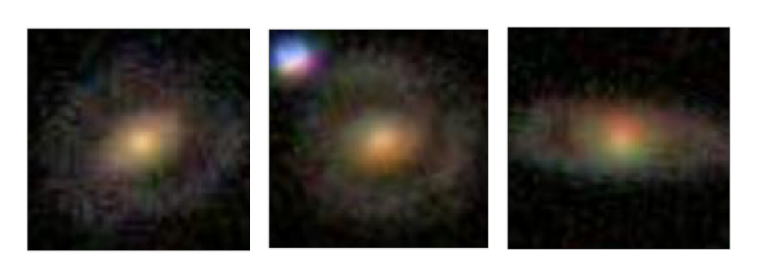
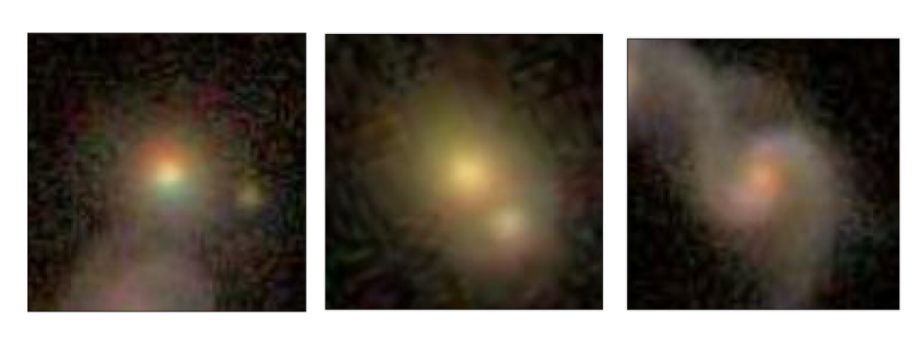

#### CLASSIFICATION
# [Classifying Galaxies Using Convolutional Neural Networks](https://www.codecademy.com/paths/build-deep-learning-models-with-tensorflow/tracks/dlsp-classification-track/modules/dlsp-image-classification/projects/classifying-galaxies-deep-learning)
Around the clock, telescopes affixed to orbital satellites and ground-based observatories are taking millions of pictures of millions upon millions of celestial bodies. 
These data, of stars, planets and galaxies provide an invaluable resource to astronomers.

However, there is a bottleneck: until the data is annotated, it’s incredibly difficult for scientists to put it to good use. 
Additionally, scientists are usually interested in subsets of the data, like galaxies with unique characteristics.

In this project, you will build a neural network to classify deep-space galaxies. 
You will be using image data curated by [Galaxy Zoo](https://www.zooniverse.org/projects/zookeeper/galaxy-zoo/), 
a crowd-sourced project devoted to annotating galaxies in support of scientific discovery.

You will identify “odd” properties of galaxies. The data falls into four classes:
* [1,0,0,0] - Galaxies with no identifying characteristics.

* [0,1,0,0] - Galaxies with rings.

* [0,0,1,0] - Galactic mergers.

* [0,0,0,1] - “Other,” Irregular celestial bodies.

## [Link to Colaboratory]()
