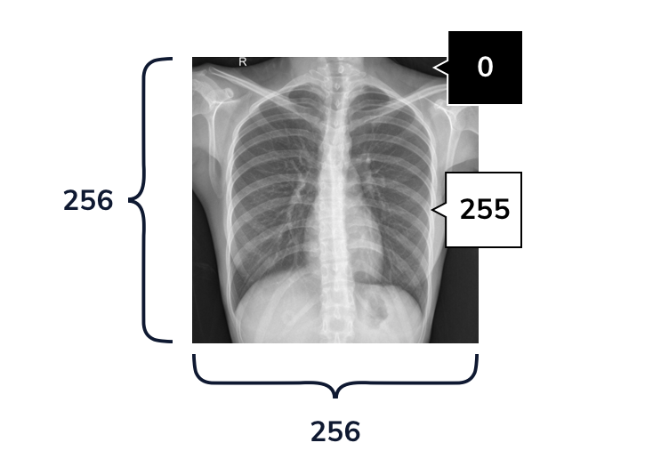

# [Introduction to Image Classification](https://www.codecademy.com/paths/build-deep-learning-models-with-tensorflow/tracks/dlsp-classification-track/modules/dlsp-image-classification/lessons/image-classification/exercises/introduction-to-image-classification)
Neural networks are perfectly suited for image classification.
The task of finding the complex patterns in pixels necessary to map an image to its label.
As a result, image classification is a common application of deep learning.

# [Preprocessing Image Data](https://www.codecademy.com/paths/build-deep-learning-models-with-tensorflow/tracks/dlsp-classification-track/modules/dlsp-image-classification/lessons/image-classification/exercises/preprocessing-image-data)
Our goal is to pass these X-ray images into our network, and to classify them according to their respective labels.
At a high-level, this is very similar to our approach for classifying non-image data.

Now, our features are going to come from image pixels.
Each image will be 256 pixels tall and 256 pixels wide, and each pixel has a value between 0 (black) - 255 (white).

