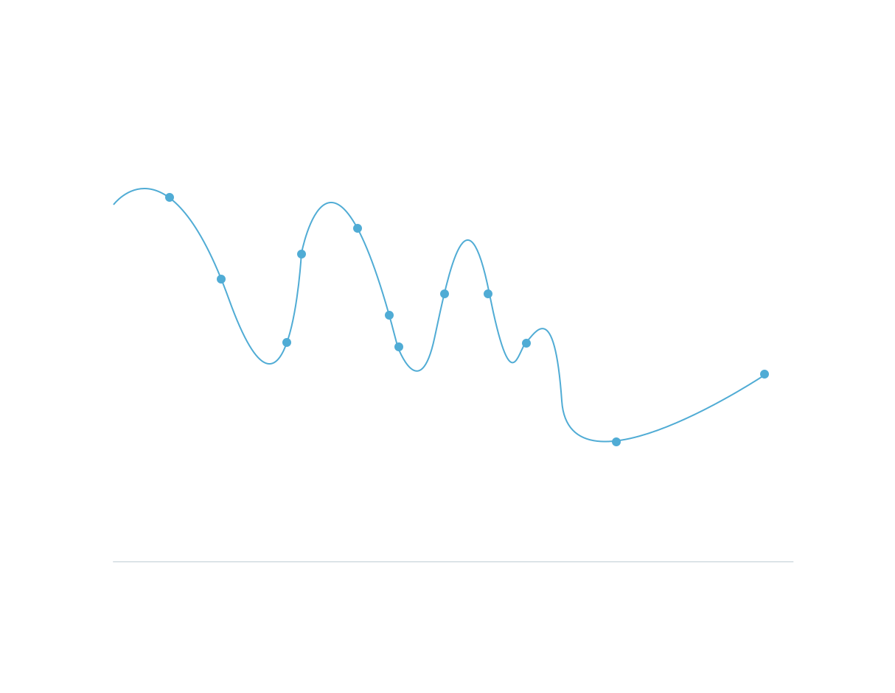
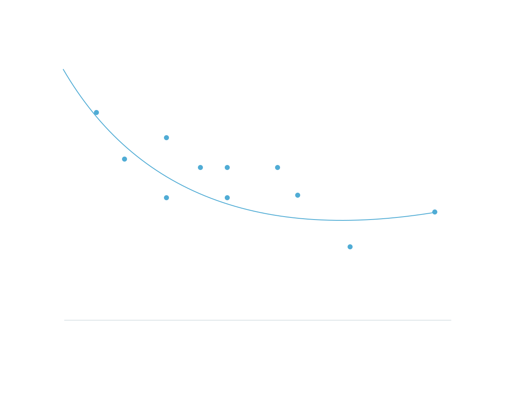
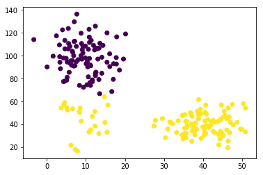

# [The Dangers of Overfitting](https://www.codecademy.com/paths/machine-learning/tracks/introduction-to-supervised-learning-skill-path/modules/accuracy-recall-and-precision-skill-path/articles/the-dangers-of-overfitting)

Learn about how to recognize when your model is fitting too closely to the training data.

Often in Machine Learning, we feed a huge amount of data to an algorithm that then learns how to classify that input based on rules it creates. 
The data we feed into this algorithm, the training data, is hugely important. 
The rules created by the program will be determined by looking at every example in the training data.

Overfitting occurs when we have fit our model’s parameters too closely to the training data:

When we overfit, we are assuming that everything we see in the training data is exactly how it will appear in the real world. 
Instead, we want to be modeling trends that show us the general behavior of a variable:

That said, when we find trends in training data, all we are doing is replicating trends that already exist. 
Our model will learn to replicate data from the real world. 
If that data is part of a system that results in prejudices or injustices, then your machine learning algorithm will produce harmful results as well. 
Some people say that Machine Learning can be a GIGO process — Garbage In, Garbage Out.

We can imagine an example where an ad agency is creating an algorithm to display the right job recommendations to the right people. If they use a training set of the kinds of people who have high paying jobs to determine which people to show ads for high paying jobs to, the model will probably learn to make decisions that leave out historically underrepresented groups of people.

This problem is fundamentally a problem with overfitting to our training set. 
If we overfit to training sets with underrepresentation, we only create more underrepresentation. 
How do we tackle this problem?

## Inspect Training Data First

Find the important aggregate statistics for the variables you’re measuring. 
Find the mean and median of different variables. 
Use groupby to inspect the aggregate statistics for different groups of data, and see how they differ. 
These are the trends that your machine learning model will replicate.

Visualize your training data and look for outstanding patterns.

Compare the aggregate statistics from your specific training set to aggregate statistics from other sources. 
Does your training set seem to follow the trends that are universally present?

## Collect Data Thoughtfully

If you have the power to control the way your data is collected, i.e. if you’re the one collecting the data, make sure that you are sampling from all groups.

Imagine for a massively multiplayer app, rewards and hotspots are set by an algorithm that trains on frequencies of user actions. 
If the people using the app overwhelmingly are in one area, the app will continuously get better and better for people in that area.

Some neighborhoods/areas might be undersampled, or have significantly less datapoints, so the algorithm will fit to the oversampled population. 
Imagine this clustering forming:

