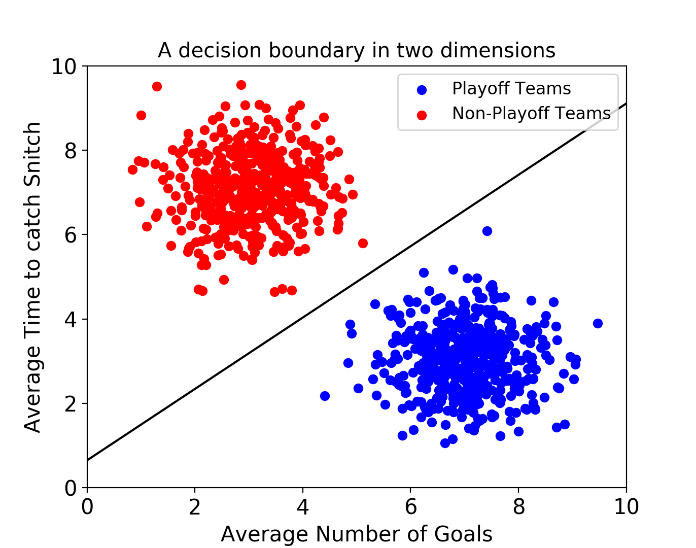

# [Support Vector Machines](https://www.codecademy.com/paths/machine-learning/tracks/advanced-supervised-learning-skill-path/modules/support-vector-machines-skill-path/lessons/machine-learning-support-vector-machine/exercises/decision-boundary)

A **Support Vector Machine (SVM)** is a powerful supervised machine learning model used for classification. 
An SVM makes classifications by defining a decision boundary and then seeing what side of the boundary an unclassified point falls on. 
In the next few exercises, we’ll learn how these decision boundaries get defined, but for now, know that they’re defined by using a training set of classified points. 
That’s why SVMs are supervised machine learning models.

Decision boundaries are easiest to wrap your head around when the data has two features. 
In this case, the decision boundary is a line.

This SVM is using data about fictional games of Quidditch from the Harry Potter universe! 
The classifier is trying to predict whether a team will make the playoffs or not. 
Every point in the training set represents a “historical” Quidditch team. 
Each point has two features — the average number of goals the team scores and the average number of minutes it takes the team to catch the Golden Snitch.

After finding a decision boundary using the training set, you could give the SVM an unlabeled data point, and it will predict whether or not that team will make the playoffs.

Decision boundaries exist even when your data has more than two features. 
If there are three features, the decision boundary is now a plane rather than a line.

