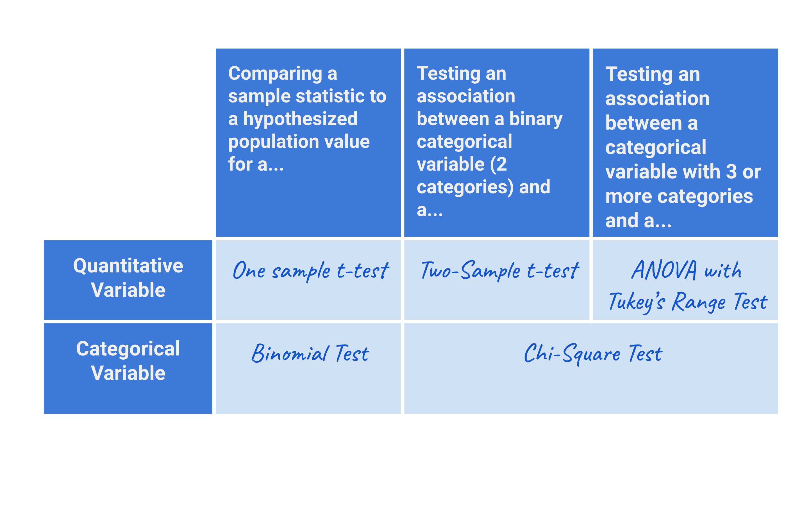

# [How to Choose a Hypothesis Test](https://www.codecademy.com/courses/hypothesis-testing-python/articles/how-to-choose-a-hypothesis-test)

Learn how to choose an appropriate hypothesis test for your data and questions.

## Introduction

In this module we’ll cover some of the key considerations for designing an experiment. 
One of the first things to consider is which statistical test is appropriate for the question you are trying to answer. 
Sometimes this will depend on the data you have available, and sometimes you will have the opportunity to decide this before starting to collect data.

There are many different types of hypothesis tests that should be used in different situations. 
In this article, we are going to briefly review some of them and when they are appropriate.

Here is a summary table of some of the hypothesis tests we’ll cover:

## Comparing a sample statistic to a hypothesized population value

In some situations, we may want to compare a sample statistic to a hypothesized population value. 
In this scenario, we have a sample of data from some population and have calculated a sample statistic (eg., a sample mean, frequency, or proportion). 
Based on this observed sample statistic, we then want to know whether the sample was likely to be drawn from a population with some hypothesized or target value of that same statistic.

For example, suppose we hypothesize that 5% of all people who access a website will buy a product. 
In order to understand if this is the case, we might find a sample of people who accessed that website and calculate that 4.3% of our sample bought a product. 
Finally, we can use a hypothesis test to determine the likelihood that, if we could observe ALL people who ever access the website, 5% of them will buy a product (even though only 4.3% of our sample did).

If we have a sample of **quantitative data**, such as *height*, *weight*, or *amount spent*, we should use a **one-sample t-test**. 
If we have a sample of **binary data**, such as *whether or not someone made a purchase* or *clicked a link*, we should use a **binomial test**.
