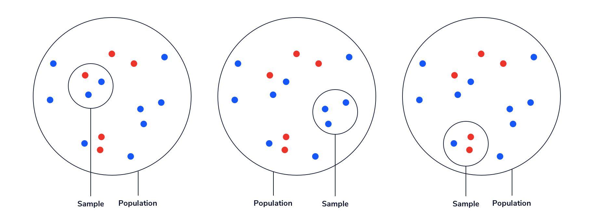

# [Introduction to Hypothesis Testing](https://www.codecademy.com/courses/hypothesis-testing-python/informationals/hp-introduction-to-hypothesis-testing)

*Descriptive statistics* and *inferential statistics* are two subfields of statistics. 
**Descriptive statistics** is all about summarizing and describing a dataset, using both numerical statistics and visualizations. 
**Hypothesis testing**, on the other hand, is *a form of inferential statistics*, which is used to draw inference about a population using a smaller sample of data.

# [Descriptive vs. Inferential Statistics](https://www.codecademy.com/courses/hypothesis-testing-python/articles/descriptive-vs-inferential-statistics)

## Introduction
Descriptive and inferential statistics are two subfields of the larger field of statistics. 
Each is used for distinct purposes. 
In this article, we will introduce and explore some of the methods associated with each one.

## Descriptive Statistics

Descriptive statistics is all about **summarizing data**. 
It is useful for making large amounts of information into an interpretable subset of numbers and/or visualizations. 
Imagine a long and complex spreadsheet; 
we would not be able to easily understand the data (any trends, patterns, or meaningful summaries) just by looking over the rows and columns. 
However, with descriptive statistics, we are able to distill that information into numbers and visualizations that we can make sense of.

Commonly used descriptive statistics include the average, median, frequency, standard deviation, and range of a set of values. 
These numeric descriptive statistics can also be displayed as visual representations, such as tables and graphs.

## Inferential Statistics

Inferential statistics is all about **using a sample** (a subset of a population) to make inferences about a larger population of interest. 
This is useful when we want to know something about a population but cannot observe every member — often due to time, feasibility, or monetary constraints. 
Some methods that are used in inferential statistics include hypothesis testing and regression.

The key to inferential statistics is understanding that samples do not always accurately reflect the population they came from. 
A large part of inferential statistics is quantifying our uncertainty about a population by looking at a smaller sample.

For example, the population shown below is made up of 10 blue dots and 5 red dots, which means that two thirds of the population is blue and one third is red. 
Suppose we take a random sample of 3 dots and want to use that sample to estimate proportion of the population that is blue. 
If we’re lucky, we’ll sample 2 blue dots and 1 red dot, as shown on the left, which would accurately represent the proportions of blue to red dots in the population. 
However, we could also randomly sample 3 blue dots, or 2 red dots and 1 blue dot — both of which do not match the population. 
Inferential statistics allows us to look at a sample and then quantify our uncertainty about how similar (or different) the entire population might be.

