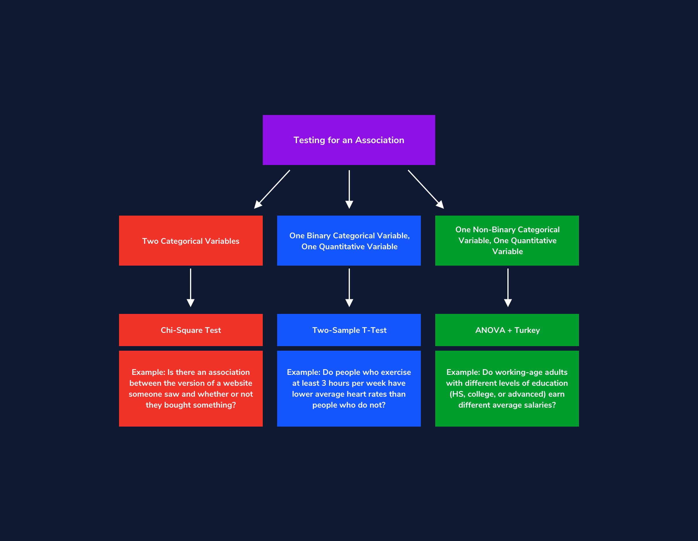

#### HYPOTHESIS TESTING: ASSOCIATIONS

# [Introduction](https://www.codecademy.com/courses/hypothesis-testing-python/lessons/hypothesis-testing-associations/exercises/introduction)

In this lesson, we’ll use hypothesis tests to make inference about population-level **associations between two variables**.

We will cover four different hypothesis tests:

* **Two Sample T-Tests** (for an association **between a quantitative variable and a binary categorical variable**)
* **ANOVA and Tukey Tests** (for an association **between a quantitative variable and a non-binary categorical variable**)
* **Chi-Square Tests** (for an association **between two categorical variables**)

# [Review](https://www.codecademy.com/courses/hypothesis-testing-python/lessons/hypothesis-testing-associations/exercises/review)

In this lesson, we have reviewed a few different ways to run a hypothesis test for an association between two variables:
* **Two Sample T-Tests** (for an association between a quantitative variable and a binary categorical variable)
* **ANOVA** and **Tukey Tests** (for an association between a quantitative variable and a non-binary categorical variable)
* **Chi-Square Tests** (for an association between two categorical variables)

