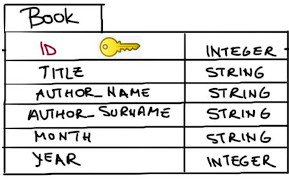
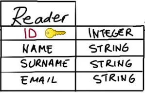

# Introduction to Flask-SQLAlchemy

## [Why have databases in your web applications?](https://www.codecademy.com/courses/learn-flask/lessons/flask-intro-sql-alchemy/exercises/databases-motivation-intro)

Web applications are often built around a lot of data that change frequently. 
The data is usually organized in entities related in some way. 
For example, entities such as users are related to products by the act of purchasing, music albums are related to a specific artist by authoring, users are related to other users by befriending, etc.

*Relational databases* offer robust and efficient data management. 
A usual relational database consists of tables that represent entities and/or relationships amongst entities. 
The attributes of entities are constrained (for example, NAME attribute is a string, and a user’s PASSWORD should not be empty). 
The way a database is organized in entities, attributes and relationships, without data being present, is called the database schema.

### Database schema design: A simple book club scenario

You want to create a personal book club application. 
Each month you pick a book your friends can review and rate. 
Your web app manages registered readers, the list of books you choose each month, and the ratings the readers write for those books. 
Moreover, you can show the annotations your friends made while reading the suggested books.

The schema for this problem is shown on bellow.


Inspect the schema by following the instructions below.

**Entities** in our database are **Reader**, **Book**, **Review** and **Annotation**. 
Those represent tables in the schema.

**Attributes** are properties of an entity and are represented as **columns** in a database table. 
For example, Reader’s attributes are NAME, SURNAME and EMAIL, and Review’s attributes are TEXT and STARS (representing ratings from 1 to 5).

**Relationships** are represented as **arrows between tables**. 
Readers are in a relationship with books by reviewing them and by making annotations. 
A reader can review and annotate multiple books. 
A book can have multiple reviews and annotations. 
Each review or annotation is associated with one book and one reader. 
We say that Reader is in a one-to-many relationship with Review, and Annotation. 
Similarly, Book is in a one-to-many relationship with Review and Annotation.

Columns with the yellow key represent the **primary key** columns that **uniquely identify entries in the table**.

Columns with the silver key symbols represent the **foreign key** columns that represent **references to the primary keys of other tables**.

Note: often when modeling application databases, nouns represent entities (readers and books) and verbs represent relationships (to review).

## [Flask application with Flask-SQLAlchemy](https://www.codecademy.com/courses/learn-flask/lessons/flask-intro-sql-alchemy/exercises/flask-sqlalchemy)

*Flask-SQLAlchemy* is an extension for Flask that supports the use of a Python SQL Toolkit called SQLAlchemy.

To start creating a minimal application, in addition to importing Flask, we also need to import `SQLAlchemy` class from the `flask_sqlalchemy` module:
```
from flask import Flask
from flask_sqlalchemy import SQLAlchemy
```
The next step is to create our Flask app instance:
```
app = Flask(__name__)
```
To enable communication with a database, the Flask-SQLAlchemy extension takes the location of the application’s database from the `SQLALCHEMY_DATABASE_URI` configuration variable we set in the following way:
```
app.config['SQLALCHEMY_DATABASE_URI'] = 'sqlite:///myDB.db' 
```
Next, we set the SQLALCHEMY_TRACK_MODIFICATIONS configuration option to False to disable a feature of Flask-SQLAlchemy that signals the application every time a change is about to be made in the database.
```
app.config['SQLALCHEMY_TRACK_MODIFICATIONS'] = False
```
Finally, we create an SQLAlchemy object and bind it to our app:
```
db = SQLAlchemy(app)
```

## [Declaring a simple model: Book](https://www.codecademy.com/courses/learn-flask/lessons/flask-intro-sql-alchemy/exercises/declaring-model-book)

The database object `db` created in our application contains all the functions and helpers from both SQLAlchemy and SQLAlchemy Object Relational Mapper (ORM). 
SQLAlchemy ORM associates user-defined Python classes with database tables, and instances of those classes (objects) with rows in their corresponding tables. 
The classes that mirror the database tables are referred to as models.

We would like to create a Flask-SQLAlchemy ORM representation of the following table schema:  


The key symbol represents the primary key column that denotes a column or a property that uniquely identifies entries in the table. 
For example, student number, social security number, SKU (stock keeping unit), ISBN (International Standard Book Number), and similar, often serve as primary keys.

`Model` represents a declarative base in SQLAlchemy which can be used to declare models. 
For `Book` to be a database model for the database instance `db`, it has to inherit from `db.Model` in the following way:
```
class Book(db.Model):
```
As you can see in the code editor, the `Book` model has 5 attributes of Column class. 
The types of the column are the first argument to Column. We use the following column types:

* `String(N)`, where N is the maximum number of characters
* Integer, representing a whole number

`Column` can take some other parameters:
* `unique`: when `True`, the values in the column must be unique
* `index`: when `True`, the column is searchable by its values
* `primary_key`: when `True`, the column serves as the primary key

## [Declaring a simple model: Reader](https://www.codecademy.com/courses/learn-flask/lessons/flask-intro-sql-alchemy/exercises/declaring-model-reader)

Adding another model or table schema to your application is simple. 
You only need to create another class that inherits from `Model`.

The model you will create next, `Reader`, is simple and similar to `Book`.

Here’s the schema representation of Reader:  


## [Declaring relationships (one-to-many)](https://www.codecademy.com/courses/learn-flask/lessons/flask-intro-sql-alchemy/exercises/relationships-one-to-many)

Often times in real-world applications we will have entities that are somehow related. 
Students take courses, customers buy products, and users comment on posts. 
In SQLAlchemy we can declare a relationship with a field initialized with the `.relationship()` method. 
In one-to-many relationships, the relationship field is used on the ‘one’ side of the relationship. 
In our use case we have the following one-to-many relationships:
1. One book ———< many reviews for that book
2. One reader ——–< many reviews from that reader

We declare a one-to-many relationship between `Book` and `Review` by creating the following field in the `Book` model:
```
reviews = db.relationship('Review', backref='book', lazy='dynamic')
```
where
* the first argument denotes which model is to be on the ‘many’ side of the relationship: `Review`.
* `backref = 'book'` establishes a `book` attribute in the related class (in our case, class `Review`) which will serve to refer back to the related `Book` object.
* `lazy = dynamic` makes related objects load as SQLAlchemy’s query objects.

By adding `relationship` to `Book` we only handled one side in our one-to-many relationship. 
Specifically, we only covered the direction denoted by the red arrow in the schema below:  
  

In the next exercise, we will add the Review model and its relationship with the Book model (the blue arrow).


