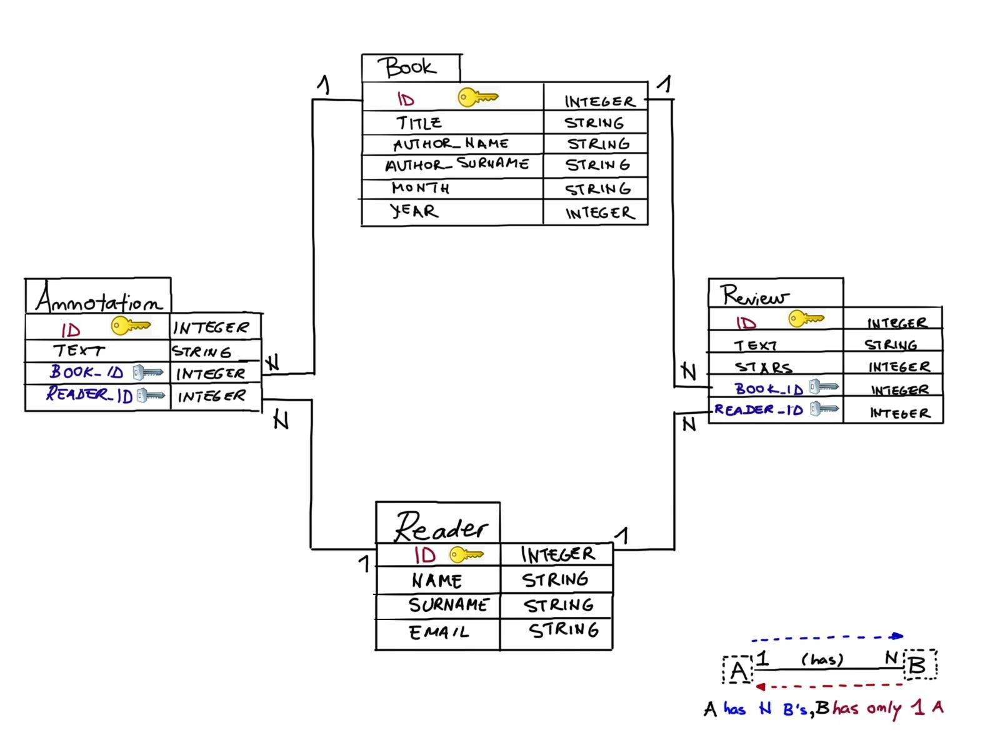

# Databases in Flask - Reading, Updating and Deleting

## [Interacting with a Database](https://www.codecademy.com/courses/learn-flask/lessons/flask-read-update-delete-database/exercises/interacting-with-database)

Your database has a number of readers who subscribed to your book club and some books you already assigned to be read. 
Also some of your readers wrote reviews about the books and some of them might have some annotations made while reading their books on an eReader. 
The schema representing the database:


What can you do with the database?

Say you want to list all the books you suggested or list all the subscribed readers. 
Or let each subscriber see only the reviews they wrote. 
When new people subscribe to your web service, you need to add them to your database, or when they unsubscribe delete them. 
If you made a mistake in changing your database, you probably want to undo the changes or ‘rollback’ to the previous correct state. 
When your subscribers change their e-mail, you need to update your database. 
Or you need to filter out the books your club read in the year 2019 and only calculate average ratings of those. 
These are all the most common interactions with a database, and in this lesson, you will learn how to perform them in Flask-SQLAlchemy.

## [Queries: query.all() and query.get()](https://www.codecademy.com/courses/learn-flask/lessons/flask-read-update-delete-database/exercises/query-all-and-query-get)

Querying a database table with Flask SQLAlchemy is done through the `query` property of the `Model` class. 
To get all entries from a model called TableName we run `TableName.query.all()`. 
Often you know the primary key (unique identifier) value of entries you want to fetch. 
To get an entry with some primary key value ID from model `TableName` you run: `TableName.query.get(ID)`.

For example, to get all the entries from the `Reader` table we do the following:
```
readers = Reader.query.all()
```
Similarly, to get a reader with `id = 123` we do the following:
```
reader = Reader.query.get(123)
```
We assign the result of the `.get()` method to a variable because through that variable we can access the entry’s attributes. 
For example:
```
reader = Reader.query.get(450)
print(reader.name)
```
Now you see the amazing convenience of using ORM: database tables are simply treated as Python classes and database entries are Python objects. 
For example, you can easily use a `for` loop to loop through all the readers and print their name:
```
readers = Reader.query.all()
for reader in readers: 
    print(reader.name)
```
