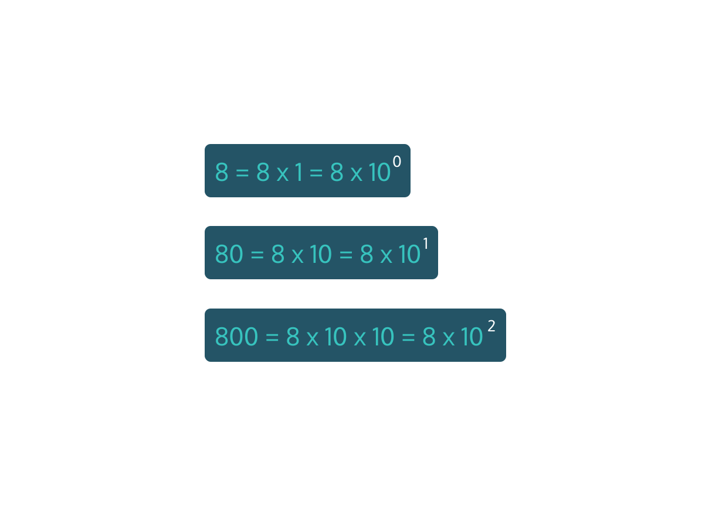
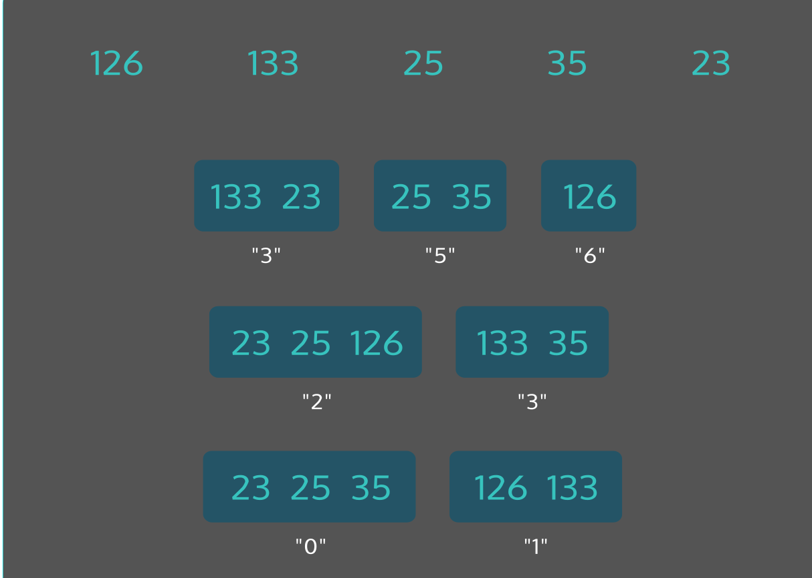

#### RADIX SORT: CONCEPTUAL

# [What Is A Radix](https://www.codecademy.com/courses/sorting-algorithms/lessons/radix-sort-conceptual/exercises/what-is-a-radix)

Quick, which number is bigger: 
1489012 or 54? It’s 1489012, but how can you tell? 
It has more digits so it has to be larger, but why exactly is that the case?

Our number system was developed by 8th century Arabic mathematicians and was successful because it 
made arithmetic operations more sensible and larger numbers easier to write and comprehend.

The breakthrough those mathematicians made required defining a set of rules for how to depict every number. 
First we decide on an alphabet: different glyphs, or digits, that we’ll use to write our numbers with. 
The alphabet that we use to depict numbers in this system are the ten digits 0, 1, 2, 3, 4, 5, 6, 7, 8, and 9. 
We call the length of this alphabet our radix (or base). 
So for our decimal system, we have a radix of 10.

Next we need to understand what those digits mean in different positions. 
In our system we have a ones place, a tens place, a hundreds place and so on. 
So what do digits mean in each of those places?

This is where explaining gets a little complicated because the actual knowledge might feel very fundamental. 
There’s a difference, for instance, between the digit ‘6’ and the actual number six that we represent with the digit ‘6’. 
This difference is similar to the difference between the letter ‘a’ (which we can use in lots of words) and the word ‘a’.

But the core of the idea is that we use these digits to represent different values when they’re used in different positions. 
The digit 6 in the number 26 represents the value 6, but the digit 6 used in the number 86452 represents the value 6000.

# [Base Numbering Systems](https://www.codecademy.com/courses/sorting-algorithms/lessons/radix-sort-conceptual/exercises/base-numbering-systems)

The value of different positions in a number increases by a multiplier of 10 in increasing positions. 
This means that a digit ‘8’ in the rightmost place of a number is equal to the value 8, but that same digit when shifted left one position (i.e., in 80) is equal to `10 * 8`. 
If you shift it again one position you get 800, which is `10 * 10 * 8`.

This is where it’s useful to incorporate the shorthand of exponential notation. 
It’s important to note that 100 is equal to 1. 
Each position corresponds to a different exponent of 10.

So why 10? 
It’s a consequence of how many digits are in our alphabet for numbering. 
Since we have 10 digits (0-9) we can count all the way up to 9 before we need to use a different position. 
This system that we used is called base-10 because of that.

# [Sorting By Radix](https://www.codecademy.com/courses/sorting-algorithms/lessons/radix-sort-conceptual/exercises/sorting-by-radix)

So how does a radix sort use this base numbering system to sort integers? 
First, there are two different kinds of radix sort: *most significant digit*, or **MSD**, and *least significant digit*, or **LSD**.

Both radix sorts organize the input list into ten “buckets”, one for each digit. 
The numbers are placed into the buckets based on the MSD (left-most digit) or LSD (right-most digit). 
For example, the number 2367 would be placed into the bucket “2” for MSD and into “7” for LSD.

This bucketing process is repeated over and over again until all digits in the longest number have been considered. 
The order within buckets for each iteration is preserved. 
For example, the numbers 23, 25 and 126 are placed in the “3”, “5”, and “6” buckets for an initial LSD bucketing. 
On the second iteration of the algorithm, they are all placed into the “2” bucket, but the order is preserved as `23, 25, 126`.

