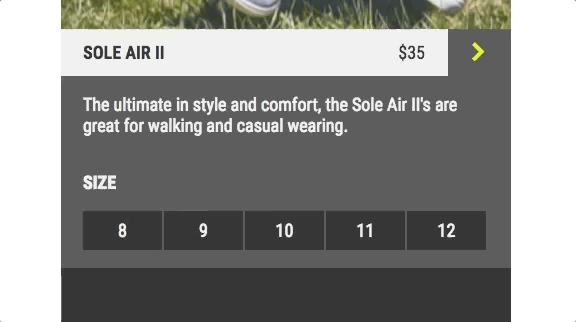
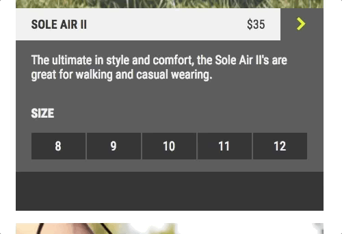

#### [Cheatsheet](https://www.codecademy.com/learn/learn-jquery/modules/learn-jquery-effects/cheatsheet)

#### LEARN JQUERY: EFFECTS

# [Introduction](https://www.codecademy.com/courses/learn-jquery/lessons/jquery-effects/exercises/effects-introduction)

jQuery Effects are a group of methods in the jQuery library that are responsible for adding dynamic behavior to websites. 
You may have seen many of these effects on modern websites without even realizing it. 
For example, you are seeing jQuery Effects in action when drop-down menus slide into place or a warning message appears after entering an incorrect password.

While adding dynamic behavior is possible using only JavaScript, the code to do so is somewhat long and confusing. 
The beauty of jQuery is how one or two lines of jQuery can replace long JavaScript code blocks.

In this course, you’ll learn how to make elements appear and disappear, fade in and out, and slide around the page. 
Let’s get started!

# [.hide()](https://www.codecademy.com/courses/learn-jquery/lessons/jquery-effects/exercises/hide)

The first tool you will add to your jQuery effects tool belt is the `.hide()` method. 
When you hide an element, your browser will render the HTML as if the hidden element does not exist. 
It will disappear from the page and the space that it was taking up will disappear as well. 
Take a look at the code below to learn how to use the `.hide()` method:
```javascript
$('.hide-arrow').on('click', () => {
  $('.shoe-information').hide();
});
```
In the example above, the event handler gets triggered whenever an element with a class of `hide-arrow` is `click`ed. 
That element could be a button, some text, an image, or any other HTML element. 
When the event is triggered, we target all elements of the class `shoe-information` and call `.hide()` on them. 
Check out the gif below to see an example.



In this gif, the `shoe-information` element hides when the `hide-arrow` button is clicked. 
Notice that the HTML elements below the `shoe-information` element move up to fill the space left by the hidden element.

# [.show()](https://www.codecademy.com/courses/learn-jquery/lessons/jquery-effects/exercises/show)

Now that we’ve learned how to hide elements on our page, we want to know how to make them reappear. 
Luckily, the `.show()` method does the opposite of `.hide()`. 
If an element on your page is hidden, `.show()` will make it appear.
```javascript
$('.show-arrow').on('click', () => {
  $('.shoe-information-2').show();
});
```
The code above should look similar to the code you wrote using `.hide()`. 
The only difference is that we are calling a different method on the targeted elements. 
This time we are calling the `.show()` method on the shoe’s textual information.

Check out the gif below to see `.show()` in action!


In this gif, all elements of class `shoe-information-2` appear when an element of class `show-arrow` is clicked.

# [.toggle()](https://www.codecademy.com/courses/learn-jquery/lessons/jquery-effects/exercises/toggle)

Our table now has two buttons that hide and show our image. 
But wouldn’t it be nice to have one button do both? 
It is common for web pages to have one button that will either hide or show elements depending on their current state. 
We can achieve this by using the `.toggle()` method.
```javascript
$('.toggle-button').on('click', () => {
  $('.shoe-information-3').toggle();
});
```
In the above code we call the `.toggle()` method on elements of class `shoe-information-3`. 
If the information is visible, clicking the `.toggle-button` will hide it, as if the following code were run.
```javascript
$('.toggle-button').on('click', () => {
  $('.shoe-information-3').hide();
});
```
At the same time, if the shoe information is hidden, it will show itself as if the following code were run:
```javascript
$('.toggle-button').on('click', () => {
  $('.shoe-information-3').show();
});
```
Take a look at the gif below to see the `.toggle()` method being called.


In this gif, the `.toggle()` method is called twice. 
The first time the arrow is clicked, `.toggle()` shows the shoe information because it was hidden. 
The second time the arrow is clicked, `.toggle()` hides the shoe information because the information was being shown. 
There’s no need to have a different button for `.hide()` and `.show()`; 
`.toggle()` can do both!

# [fading](https://www.codecademy.com/courses/learn-jquery/lessons/jquery-effects/exercises/fade)

In this exercise, you will learn about two new methods that are similar to `.hide()` and `.show()`. 
Take a look at the gif below:



In this gif, the `.fadeIn()` method is called on an HTML element. 
Instead of instantly showing the element, `.fadeIn()` and `.fadeOut()` make the element appear or disappear over a given period of time. 
You can think of this as an animation. 
The transition between being visible and invisible happens over a duration of time.

Both `.fadeIn()` and `.fadeOut()` take an optional parameter that specifies how long the animation will take. 
For example, in the code below, all `<div>` elements will fade out over a period of 1000 milliseconds (or one second).
```javascript
$('div').fadeOut(1000);
```
In the example above, the `1000` argument is optional; you don’t need to put a number between the parentheses. 
This number represents the number of milliseconds it takes for the animation to complete. 
If no argument is given, the default animation duration is 400 milliseconds.

# [.fadeToggle()](https://www.codecademy.com/courses/learn-jquery/lessons/jquery-effects/exercises/fade-toggle)

With fade, our website is starting to look dynamic. 
`.fadeToggle()` is the third and final method in this trio of fade methods. 
This method is similar to `.toggle()`. 
If you call `.fadeToggle()` on an element that is invisible, it will fade in. 
And if the element is already visible, then `.fadeToggle()` will make it fade out.

Like the other fade methods, `.fadeToggle()` can take an argument that sets the duration of the effect.
```javascript
$('div').fadeToggle(1000);
```
In the example above, all `div` elements will fade in or out over a period of 1000 milliseconds. 
Hidden div elements will fade in, and visible div elements will fade out.

# [Sliding](https://www.codecademy.com/courses/learn-jquery/lessons/jquery-effects/exercises/sliding)

Have you ever been to a website and seen HTML elements slide into place? 
Many websites use this effect to show menus; 
you click on your profile image and a menu slides down revealing different settings and options that you can change. 
These sites are likely using jQuery sliding effects.

By using sliding effects, an element on your web page will slide up or down into place instead of appearing or disappearing. 
Just like with the other effects, sliding can be applied to any element on your page whether it be an image, a video, or text.

Sliding methods are animations; they happen over a period of time. 
As a result, sliding methods have an optional parameter to determine how long the animation will take.
```javascript
$('.menu-button').on('click', () => {
  $('.menu-content').slideDown('slow');
});
```
In the above code, we call the `.slideDown()` method on the elements of class `menu-content` whenever `menu-button` elements are clicked. 
The `slow` parameter determines the speed of the animation. 
That code will produce something that looks like this:


The menu-button element is clicked and the menu-content element slides down into place

There are two other sliding methods in jQuery Effects. 
Use the [documentation](https://api.jquery.com/category/effects/) 
to find their names and read about their usage. 
One is used to slide elements up, and the other is used to toggle sliding effects.


