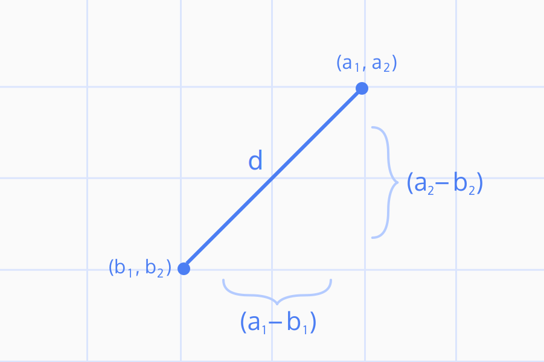
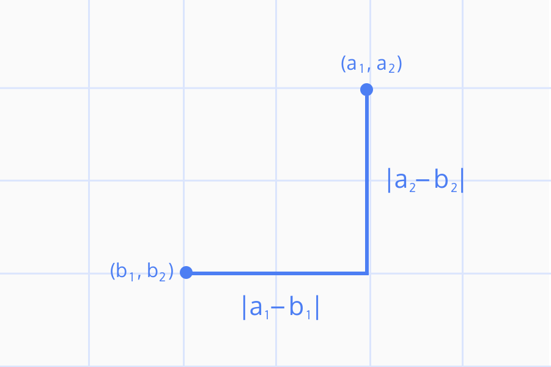

# 
## [Representing Points](https://www.codecademy.com/courses/machine-learning/lessons/distance-formula/exercises/points)
In this lesson, you will learn three different ways to define the distance between two points:
1. Euclidean Distance
2. Manhattan Distance
3. Hamming Distance

In this exercise, we will use a list, where each item in the list represents a dimension of the point: `pt1 = [5, 8]`
Points aren’t limited to just two dimensions: a five-dimensional point could be represented as `[4, 8, 15, 16, 23]`.

Ultimately, we want to find the distance between two points.
We can only find the difference between two points if they have the same number of dimensions!

## [Euclidean Distance](https://www.codecademy.com/courses/machine-learning/lessons/distance-formula/exercises/euclidean-distance)
To find the Euclidean distance between two points, we first calculate the squared distance between each dimension.
If we add up all of these squared differences and take the square root, we’ve computed the Euclidean distance.

The image below shows a visual of Euclidean distance being calculated:

## [Manhattan Distance](https://www.codecademy.com/courses/machine-learning/lessons/distance-formula/exercises/manhattan-distance)
Rather than summing the squared difference between each dimension, we instead sum the absolute value of the difference between each dimension.
It’s called Manhattan distance because it’s similar to how you might navigate when walking city blocks.

Take a look at the image below visualizing Manhattan Distance:

## [Hamming Distance](https://www.codecademy.com/courses/machine-learning/lessons/distance-formula/exercises/hamming-distance)
Instead of finding the difference of each dimension, Hamming distance only cares about whether the dimensions are exactly equal.
When finding the Hamming distance between two points, add one for every dimension that has different values.
Hamming distance is used in spell checking algorithms.
For example, the Hamming distance between the word “there” and the typo “thete” is one. 
Each letter is a dimension, and each dimension has the same value except for one.

## [SciPy Distances](https://www.codecademy.com/courses/machine-learning/lessons/distance-formula/exercises/review)
* Euclidean Distance: `.euclidean()`
* Manhattan Distance: `.cityblock()`; computing Manhattan distance is like asking how many blocks away you are from a point.
* Hamming Distance: `.hamming()`; always return a number between 0 an 1. 
Rather than summing the number of differences in dimensions, this implementation sums those differences and then divides by the total number of dimensions.
In your implementation, the Hamming distance between `[1, 2, 3]` and `[7, 2, -10]` would be `2`. In scipy‘s version, it would be `2/3`.
