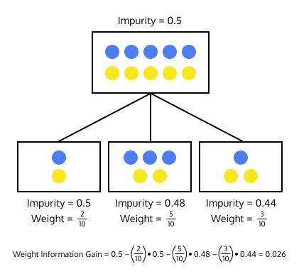

# [Decision Trees](https://www.codecademy.com/courses/machine-learning/lessons/ml-decision-trees/exercises/trees)

Decision trees are machine learning models that try to find patterns in the features of data points.

## [Making Decision Trees](https://www.codecademy.com/courses/machine-learning/lessons/ml-decision-trees/exercises/creating-trees)

If we’re given this magic tree, it seems relatively easy to make classifications.
Decision trees are supervised machine learning models, which means that they’re created from a training set of labeled data.
Creating the tree is where the *learning* in machine learning happens.


We begin with every point in the training set at the top of the tree.
These training points have labels — the red points represent students that didn’t get an A on a test and the green points represent students that did get an A on a test.

We then decide to split the data into smaller groups based on a feature.

Once we have these subsets, we repeat the process — we split the data in each subset again on a different feature.

Eventually, we reach a point where we decide to stop splitting the data into smaller groups. 
We’ve reached a leaf of the tree. We can now count up the labels of the data in that leaf. 
If an unlabeled point reaches that leaf, it will be classified as the majority label.

## [Gini Impurity](https://www.codecademy.com/courses/machine-learning/lessons/ml-decision-trees/exercises/impurity)

To find the Gini impurity, start at 1 and subtract the squared percentage of each label in the set.
```
impurity = 1
```
For example, if a data set had three items of class `A` and one item of class `B`, the Gini impurity of the set would be:  


If a data set has only one class, you’d end up with a Gini impurity of 0. The lower the impurity, the better the decision tree!  


```
def gini(labels):
  label_keys = set(labels)
  total_number_of_labels = len(labels)
  impurity = 1
  for label in label_keys:
    probability_of_label = labels.count(label) / total_number_of_labels
    impurity = impurity - probability_of_label ** 2
  return impurity
```

`gini_impurity.py`

## [Information Gain](https://www.codecademy.com/courses/machine-learning/lessons/ml-decision-trees/exercises/information-gain)

We know that we want to end up with leaves with a low Gini Impurity, but we still need to figure out which features to split on in order to achieve this. 

To answer this question, we can calculate the information gain of splitting the data on a certain feature.
Information gain measures difference in the impurity of the data before and after the split.  
  

By splitting the data in that way, we’ve gained some information about how the data is structured — the datasets after the split are purer than they were before the split. 
The higher the information gain the better — if information gain is 0, then splitting the data on that feature was useless!  

`information_gain.py`

## [Weighted Information Gain](https://www.codecademy.com/courses/machine-learning/lessons/ml-decision-trees/exercises/weighted-information-gain)
We’re not quite done calculating the information gain of a set of objects.
The sizes of the subset that get created after the split are important too!
For example, the image below shows two sets with the same impurity. 
Which set would you rather have in your decision tree?  
  
Both of these sets are perfectly pure, but the purity of the second set is much more meaningful.

It might be helpful to think about the inverse as well. Consider these two sets with the same impurity:
  
Both of these sets are completely impure. 
However, that impurity is much more meaningful in the set with more instances.
The impurity of the set with two items isn’t as important. 
We know that we’ll only need to split the set one more time in order to make two pure sets.

Let’s modify the formula for information gain to reflect the fact that the size of the set is relevant. 
Instead of simply subtracting the impurity of each set, we’ll subtract the weighted impurity of each of the split sets.
If the data before the split contained `20` items and one of the resulting splits contained `2` items, then the weighted impurity of that subset would be `2 / 20 * impurity`.
We’re lowering the importance of the impurity of sets with few elements.  
  
Now that we can calculate the information gain using weighted impurity, let’s do that for every possible feature. 
If we do this, we can find the best feature to split the data on.
```
def information_gain(starting_labels, split_labels):
  info_gain = gini(starting_labels)
  for subset in split_labels:
    # Multiply gini(subset) by the correct percentage below
    weight = len(subset) / len(starting_labels)
    info_gain -= gini(subset) * weight
  return info_gain
```
`weighted_information_gain.py`

## [Recursive Tree Building](https://www.codecademy.com/courses/machine-learning/lessons/ml-decision-trees/exercises/recursion)

Now that we can find the best feature to split the dataset, we can repeat this process again and again to create the full tree.
We start with every data point from the training set, find the best feature to split the data, split the data based on that feature, and then recursively repeat the process again on each subset that was created from the split.
We’ll stop the recursion when we can no longer find a feature that results in any information gain.
In other words, we want to create a leaf of the tree when we can’t find a way to split the data that makes purer subsets.

### `find_best_split()`
* Takes a set of data points and a set of labels
* returns the index of the feature that causes the **best split** and the **information gain** caused by that split

### `build_tree()`
* Takes `data` and `labels` as parameters.
* 
  * If `best_gain` is `0`, return a `Counter` object of `labels`: We’ve reached the base case — there’s no way to gain any more information so we want to create a leaf.
  * the recursive case: 
    * we want to split the data into subsets using the best feature, and then recursively call the `build_tree()` function on those subsets to create subtrees
    * Finally, we want to return a list of all those subtrees.

`branches` : This list will store all of the subtrees we’re about to make from our recursive calls.  
We now want to loop through all of the subsets of data and labels.

### `split()`
* takes three parameters: the `data` and `labels` that you want to split and the `index` of the feature you want to split on.
* returns: `data_subsets` and `label_subsets`

`recursive_tree_building.py`  
`tree.py`

## [Classifying New Data](https://www.codecademy.com/courses/machine-learning/lessons/ml-decision-trees/exercises/classify)
We can finally use our tree as a classifier!
Given a new data point, we start at the top of the tree and follow the path of the tree until we hit a leaf. 
Once we get to a leaf, we’ll use the classes of the points from the training set to make a classification.

We’ve slightly changed the way our build_tree() function works.
Instead of returning a list of branches or a `Counter` object, the `build_tree()` function now returns a `Leaf` object or an `Internal_Node` object. 

### `classify()`
Tke a datapoint and a tree as a parameter.
`classify()` is check if we’re at a leaf by using the `isinstance()` function: `if isinstance(tree, Leaf)` 

If we’ve found a Leaf, that means we want to return the label with the highest count.

If we’re not at a leaf, we want to find the branch that corresponds to our data point.

`classifying_new_data.py`  
`tree_final.py`  
`cars.py`

## [Decision Trees in scikit-learn](https://www.codecademy.com/courses/machine-learning/lessons/ml-decision-trees/exercises/sklearn)
The `sklearn.tree` module contains the `DecisionTreeClassifier` class.
To create a DecisionTreeClassifier object, call the constructor:
```
from sklearn.tree import DecisionTreeClassifier

classifier = DecisionTreeClassifier()
```
Next, we want to create the tree based on our training data. To do this, we’ll use the `.fit()` method.

`.fit()` takes a list of **data** points followed by a list of the **labels** associated with that data. 

When we built our tree from scratch, our data points contained strings like `"vhigh"` or `"5more"`. When creating the tree using `scikit-learn`, it’s a good idea to map those strings to numbers.
For example, for the first feature representing the price of the car, `"low"` would map to `1`, `"med"` would map to `2`, and so on. (`change_data()`)
```
classifier.fit(training_data, training_labels)
```
Finally, once we’ve made our tree, we can use it to classify new data points.
The `.predict()` method takes an array of data points and will return an array of classifications for those data points.
```
predictions = classifier.predict(test_data)
```
If you’ve split your data into a test set, you can find the accuracy of the model by calling the `.score()` method using the test data and the test labels as parameters.
```
print(classifier.score(
  test_data, 
  test_labels
))
```
`.score()` returns the percentage of data points from the test set that it classified correctly.

## [Decision Tree Limitations](https://www.codecademy.com/courses/machine-learning/lessons/ml-decision-trees/exercises/greedy)
One problem with the way we’re currently making our decision trees is that our trees aren’t always *globablly optimal*.
This means that there might be a better tree out there somewhere that produces better results.

Our current strategy of creating trees is *greedy*. 
We assume that the best way to create a tree is to find the feature that will result in the largest information gain right now and split on that feature. 
We never consider the ramifications of that split further down the tree.
It’s possible that if we split on a suboptimal feature right now, we would find even better splits later on.
Unfortunately, finding a globally optimal tree is an extremely difficult task, and finding a tree using our greedy approach is a reasonable substitute.

Another problem with our trees is that they potentially *overfit* the data.
This means that the structure of the tree is too dependent on the training data and doesn’t accurately represent the way the data in the real world looks like.
Larger trees tend to overfit the data more.
As the tree gets bigger, it becomes more tuned to the training data and it loses a more generalized understanding of the real world data.

One way to solve this problem is to ***prune the tree***.
The goal of pruning is to shrink the size of the tree.
`scikit-learn` currently doesn’t prune the tree by default, however we can dig into the code a bit to prune it ourselves.

You can find the depth of the tree by printing `classifier.tree_.max_depth`.
Take note of the accuracy as well. `classifier.score(testing_points, testing_labels)`

When you create classifier, you can set the parameter: `max_depth`
```
classifier = DecisionTreeClassifier(
  random_state = 0,
  max_depth = 11
)
```
Take note of the accuracy again!

## [Review](https://www.codecademy.com/courses/machine-learning/lessons/ml-decision-trees/exercises/review)

* Good decision trees have pure leaves. A leaf is pure if all of the data points in that class have the same label.
* Decision trees are created using a greedy algorithm that prioritizes finding the feature that results in the largest information gain when splitting the data using that feature.
* Creating an optimal decision tree is difficult. The greedy algorithm doesn’t always find the globally optimal tree.
* Decision trees often suffer from overfitting. Making the tree small by pruning helps to generalize the tree so it is more accurate on data in the real world.

