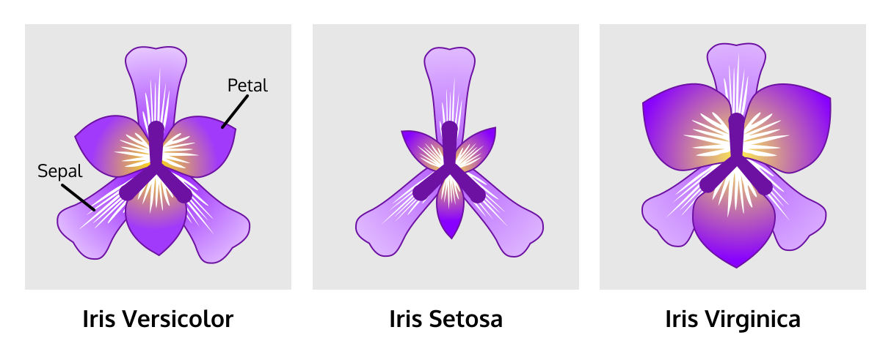

# K-Means Clustering

## [Introduction to Clustering](https://www.codecademy.com/courses/machine-learning/lessons/machine-learning-clustering/exercises/introduction)

Often, the data you encounter in the real world won’t have flags attached and won’t provide labeled answers to your question. 
Finding patterns in this type of data, unlabeled data, is a common theme in many machine learning applications. 
Unsupervised Learning is how we find patterns and structure in these data.

**Clustering** is the most well-known unsupervised learning technique.
It finds structure in unlabeled data by identifying similar groups, or clusters.
Examples of clustering applications are:
* **Recommendation engines:** group products to personalize the user experience
* **Search engines:** group news topics and search results
* **Market segmentation:** group customers based on geography, demography, and behaviors
* **Image segmentation:** medical imaging or road scene segmentation on self-driving cars

## [K-Means Clustering](https://www.codecademy.com/courses/machine-learning/lessons/machine-learning-clustering/exercises/k-means)

The goal of clustering is to separate data so that data similar to one another are in the same group, while data different from one another are in different groups. 
So two questions arise:
* How many groups do we choose?
* How do we define similarity?

*K-Means* is the most popular and well-known clustering algorithm, and it tries to address these two questions.
* **K:** refers to the number of clusters (groups) we expect to find in a dataset
* **Means:** refers to the average distance of data to each cluster center, also known as the **centroid**, which we are trying to minimize.

It is an iterative approach:
1. Place `k` random centroids for the initial clusters.
2. Assign data samples to the nearest centroid.
3. Update centroids based on the above-assigned data samples.

Repeat Steps 2 and 3 until *convergence* (when points don’t move between clusters and centroids stabilize).


Once we are happy with our clusters, we can take a new unlabeled datapoint and quickly assign it to the appropriate cluster.

## [Iris Dataset](https://www.codecademy.com/courses/machine-learning/lessons/machine-learning-clustering/exercises/iris-dataset)

The sklearn package embeds some datasets and sample images. 
One of them is the [Iris dataset](https://en.wikipedia.org/wiki/Iris_flower_data_set).

The Iris dataset consists of measurements of sepals and petals of 3 different plant species:
* Iris setosa
* Iris versicolor
* Iris virginica



The sepal is the part that encases and protects the flower when it is in the bud stage. 
A petal is a leaflike part that is often colorful.

From sklearn library, import the datasets module:
```
from sklearn import datasets
```
To load the Iris dataset:
```
iris = datasets.load_iris()
```
The Iris dataset looks like:
```
[[ 5.1  3.5  1.4  0.2 ]
 [ 4.9  3.   1.4  0.2 ]
 [ 4.7  3.2  1.3  0.2 ]
 [ 4.6  3.1  1.5  0.2 ]
   . . .
 [ 5.9  3.   5.1  1.8 ]]
```
We call each piece of data a ***sample***. 
For example, each flower is one sample. `[ 5.1  3.5  1.4  0.2 ]`

Each characteristic we are interested in is a ***feature***.
For example, petal length is a feature of this dataset.

The features of the dataset are:
* **Column 0:** Sepal length  `5.1`
* **Column 1:** Sepal width   `3.5`
* **Column 2:** Petal length  `1.4`
* **Column 3:** Petal width   `0.2`

## [Visualize Before K-Means](https://www.codecademy.com/courses/machine-learning/lessons/machine-learning-clustering/exercises/visualize-iris)

With Matplotlib, we can create a 2D scatter plot of the Iris dataset using two of its features (sepal length vs. petal length).
The sepal length measurements are stored in column `0` of the matrix, and the petal length measurements are stored in column `2` of the matrix.
We only want to retrieve the values that are in column 0 of a matrix:
```
matrix[ :, 0]
```
`[:,0]` can be translated to `[all_rows , column_0]`

Once you have the measurements we need, we can make a scatter plot:
```
plt.scatter(x, y)

plt.show()
```

## [Implementing K-Means](https://www.codecademy.com/courses/machine-learning/lessons/machine-learning-clustering/exercises/step-1)

The K-Means algorithm:
1. Place k random centroids for the initial clusters.
2. Assign data samples to the nearest centroid.
3. Update centroids based on the above-assigned data samples.

Repeat Steps 2 and 3 until convergence.

---------

### 1. Place k random centroids for the initial clusters

Because we expect there to be three clusters (for the three species of flowers), let’s implement K-Means where the k is 3.
```
# Number of clusters
k = 3
```
Using the NumPy library, we will create three random initial centroids and plot them along with our samples.
```
# Create x coordinates of k random centroids
centroids_x = np.random.uniform(
  min(x), 
  max(x), 
  size = k
)

# Create y coordinates of k random centroids
centroids_y = np.random.uniform(
  min(y), 
  max(y), 
  size = k
)

# Create centroids array
centroids = np.array(list(zip(centroids_x, centroids_y)))
#print(centroids)
```

### 2. Assign data samples to the nearest centroid

Now we have the three random centroids. 
Let’s assign data points to their nearest centroids.

To do this we’re going to use a 
[Distance Formula](https://github.com/lendoo73/Challenge-Project-of-CodeCademy/tree/master/python/Learn_the_Basics_of_Machine_Learning/Classification_K_Nearest_Neighbors/Distance_formula) to write a distance() 
function.
Then, we are going to iterate through our data samples and compute the distance from each data point to each of the 3 centroids.

### 3. Update centroids based on the above-assigned data samples

Find new cluster centers by taking the average of the assigned points.
We can use the `.mean()` function.

Save the old centroids value before updating.
```
centroids_old = np.copy(centroids)
```
Then, create a for loop that iterates k times.

### 4. Repeat Steps 2 and 3 until convergence

This is the part of the algorithm where we repeatedly execute Step 2 and 3 until the centroids stabilize (convergence).

We can do this using a while loop. And everything from Step 2 and 3 goes inside the loop.

For the condition of the while loop, we need to create an array named errors. 
In each error index, we calculate the difference between the updated centroid (centroids) and the old centroid (centroids_old).

The loop ends when all three values in errors are `0`.
