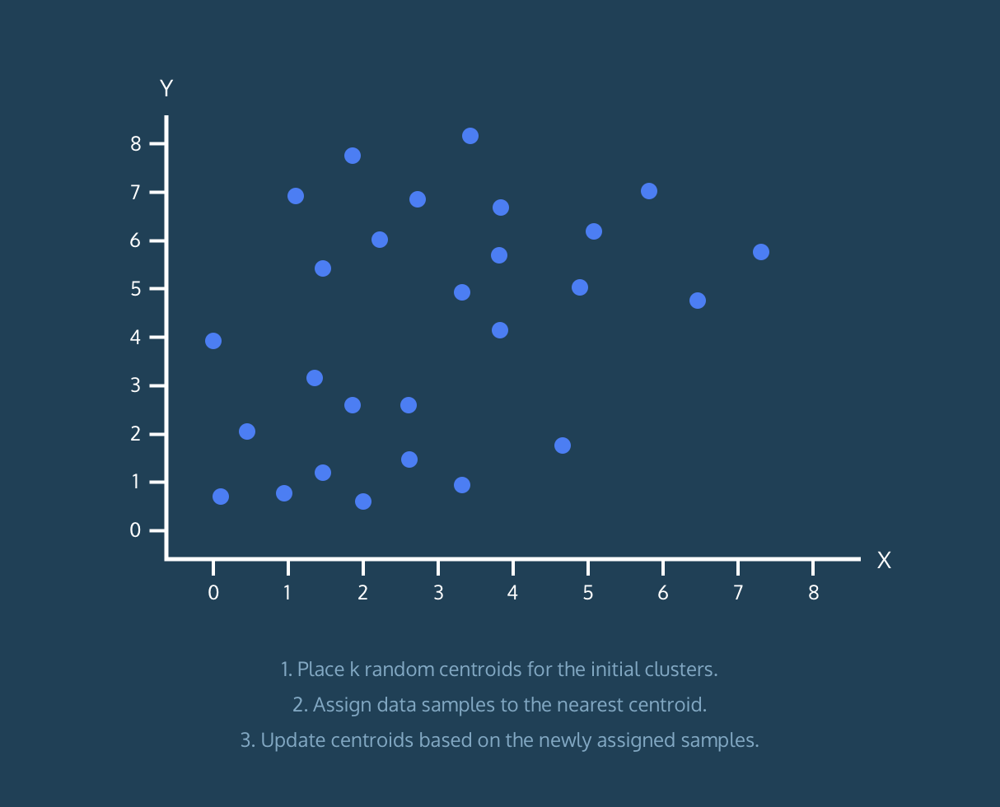

# K-Means Clustering

## [Introduction to Clustering](https://www.codecademy.com/courses/machine-learning/lessons/machine-learning-clustering/exercises/introduction)

Often, the data you encounter in the real world won’t have flags attached and won’t provide labeled answers to your question. 
Finding patterns in this type of data, unlabeled data, is a common theme in many machine learning applications. 
Unsupervised Learning is how we find patterns and structure in these data.

**Clustering** is the most well-known unsupervised learning technique.
It finds structure in unlabeled data by identifying similar groups, or clusters.
Examples of clustering applications are:
* **Recommendation engines:** group products to personalize the user experience
* **Search engines:** group news topics and search results
* **Market segmentation:** group customers based on geography, demography, and behaviors
* **Image segmentation:** medical imaging or road scene segmentation on self-driving cars

## [K-Means Clustering](https://www.codecademy.com/courses/machine-learning/lessons/machine-learning-clustering/exercises/k-means)

The goal of clustering is to separate data so that data similar to one another are in the same group, while data different from one another are in different groups. 
So two questions arise:
* How many groups do we choose?
* How do we define similarity?

*K-Means* is the most popular and well-known clustering algorithm, and it tries to address these two questions.
* **K:** refers to the number of clusters (groups) we expect to find in a dataset
* **Means:** refers to the average distance of data to each cluster center, also known as the **centroid**, which we are trying to minimize.

It is an iterative approach:
1. Place `k` random centroids for the initial clusters.
2. Assign data samples to the nearest centroid.
3. Update centroids based on the above-assigned data samples.

Repeat Steps 2 and 3 until *convergence* (when points don’t move between clusters and centroids stabilize).

Once we are happy with our clusters, we can take a new unlabeled datapoint and quickly assign it to the appropriate cluster.
