#### INTRODUCTION TO LINEAR REGRESSION

# [Introduction to Linear Regression](https://www.codecademy.com/courses/linear-regression-mssp/lessons/introduction-to-linear-regression/exercises/introduction-to-linear-regression)

Linear regression is a powerful modeling technique that can be used to understand the relationship between a quantitative variable and one or more other variables, 
sometimes with the goal of making predictions. 
For example, linear regression can help us answer questions like:
* What is the relationship between apartment size and rental price for NYC apartments?
* Is a mother’s height a good predictor of their child’s adult height?

The first step before fitting a linear regression model is exploratory data analysis and data visualization: is there a relationship that we can model? 
For example, suppose we collect heights (in cm) and weights (in kg) for 9 adults and inspect a plot of height vs. weight:
```py
plt.scatter(data.height, data.weight)
plt.xlabel('height (cm)')
plt.ylabel('weight (kg)')
plt.show()
```


Scatter plot showing a positive linear relationship between height and weight (people who are taller tend to weigh more)

When we look at this plot, we see that there is some evidence of a relationship between height and weight: people who are taller tend to weigh more. 
In the following exercises, we’ll learn how to model this relationship with a line. 
If you were to draw a line through these points to describe the relationship between height and weight, what line would you draw?

# [Equation of a Line](https://www.codecademy.com/courses/linear-regression-mssp/lessons/introduction-to-linear-regression/exercises/equation-of-a-line)

Like the name implies, LINEar regression involves fitting a line to a set of data points. 
In order to fit a line, it’s helpful to understand the equation for a line, which is often written as y = mx + b. 
In this equation:
* x and y represent variables, such as height and weight or hours of studying and quiz scores.
* b represents the y-intercept of the line. This is where the line intersects with the y-axis (a vertical line located at x = 0).
* m represents the slope. This controls how steep the line is. If we choose any two points on a line, the slope is the ratio between the vertical and horizontal distance between those points; this is often written as rise/run.

The following plot shows a line with the equation y = 2x + 12:

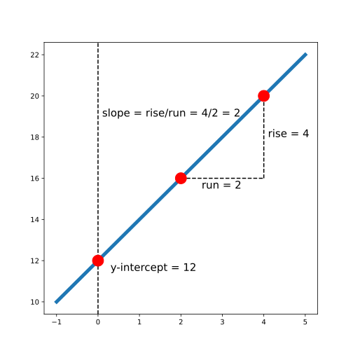

image showing a line with a point at the y-axis (a vertical line where the x-variable is equal to zero) labeled "y-intercept." 
The line also has two other points, which are connected by a horizontal and vertical dashed line, labeled "run" and "rise," respectively. 
The slope is calculated as rise/run which is equal to 2 in this example.

Note that we can also have a line with a negative slope. 
For example, the following plot shows the line with the equation y = -2x + 8:

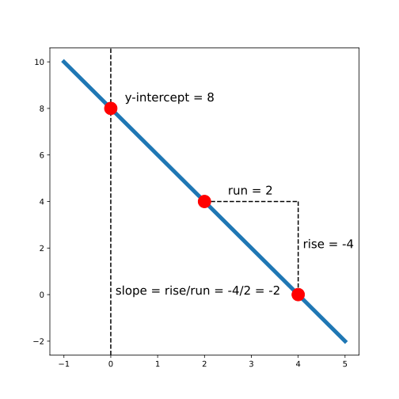

image showing a line with a point at the y-axis (a vertical line where the x-variable is equal to zero) labeled "y-intercept." 
The line also has two other points, which are connected by a horizontal and vertical dashed line, labeled "run" and "rise," respectively. 
The slope is calculated as rise/run which is equal to -2 in this example.

# [Finding the "Best" Line](https://www.codecademy.com/courses/linear-regression-mssp/lessons/introduction-to-linear-regression/exercises/finding-the-best-line)

In the last exercise, we tried to eye-ball what the best-fit line might look like. 
In order to actually choose a line, we need to come up with some criteria for what “best” actually means.

Depending on our ultimate goals and data, we might choose different criteria; 
however, a common choice for linear regression is ordinary least squares (OLS). 
In simple OLS regression, we assume that the relationship between two variables x and y can be modeled as:


We define “best” as the line that minimizes the total squared error for all data points. 
This total squared error is called the loss function in machine learning. 
For example, consider the following plot:

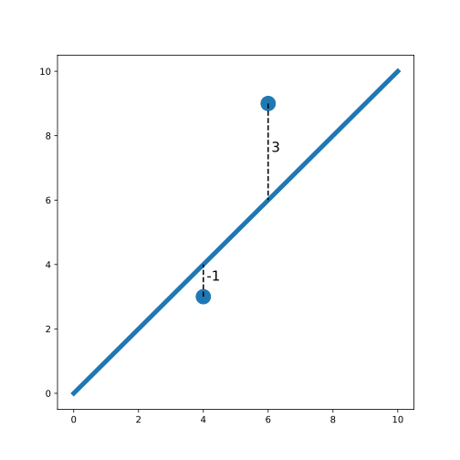

plot showing two points on either side of a line. 
One point is one unit below the line and has a label of -1; the other is 3 units above the line and has a label of 3

In this plot, we see two points on either side of a line. 
One of the points is one unit below the line (labeled -1). 
The other point is three units above the line (labeled 3). 
The total squared error (loss) is:


Notice that we square each individual distance so that points below and above the line contribute equally to loss (when we square a negative number, the result is positive). 
To find the best-fit line, we need to find the slope and intercept of the line that minimizes loss.

# [Fitting a Linear Regression Model in Python](https://www.codecademy.com/courses/linear-regression-mssp/lessons/introduction-to-linear-regression/exercises/fitting-a-linear-regression-model-in-python)

There are a number of Python libraries that can be used to fit a linear regression, 
but in this course, we will use the `OLS.from_formula()` function from `statsmodels.api` because it uses simple syntax and provides comprehensive model summaries.

Suppose we have a dataset named `body_measurements` with columns `height` and `weight`. 
If we want to fit a model that can predict weight based on height, we can create the model as follows:
```py
model = sm.OLS.from_formula('weight ~ height', data = body_measurements)
```

We used the formula `'weight ~ height'` because we want to predict **weight** (it is the **outcome** variable) using **height** as a **predictor**. 
Then, we can fit the model using `.fit()`:
```py
results = model.fit()
```
Finally, we can inspect a summary of the results using `print(results.summary())`. 
For now, we’ll only look at the coefficients using `results.params`, but the full summary table is useful because it contains other important diagnostic information.
```py
print(results.params)
```
Output:
```py
Intercept   -21.67
height        0.50
dtype: float64
```
This tells us that the best-fit intercept is `-21.67`, and the best-fit slope is `0.50`.

# [Using a Regression Model for Prediction](https://www.codecademy.com/courses/linear-regression-mssp/lessons/introduction-to-linear-regression/exercises/using-a-regression-model-for-prediction)

Suppose that we have a dataset of heights and weights for 100 adults. 
We fit a linear regression and print the coefficients:
```py
model = sm.OLS.from_formula('weight ~ height', data = body_measurements)
results = model.fit()
print(results.params)
```
Output:
```py
Intercept   -21.67
height        0.50
dtype: float64
```
This regression allows us to predict the weight of an adult if we know their height. 
To make a prediction, we need to plug in the intercept and slope to our equation for a line. 
The equation is:


To make a prediction, we can plug in any height. 
For example, we can calculate that the expected weight for a 160cm tall person is 58.33kg:


In python, we can calculate this by plugging in values or by accessing the intercept and slope from `results.params` using their indices (`0` and `1`, respectively):
```py
print(0.50 * 160 - 21.67) 
# Output: 58.33
 
# OR:
 
print(results.params[1]*160 + results.params[0])
# Output: 58.33
```
We can also do this calculation using the `.predict()` method on the fitted model. 
To predict the weight of a 160 cm tall person, we need to first create a new dataset with `height` equal to `160` as shown below:
```py
newdata = {"height":[160]}
print(results.predict(newdata))
Output:

0      58.33
dtype: float64
```
Note that we get the same result (`58.33`) as with the other methods; however, it is returned as a data frame.

# [Interpreting a Regression Model](https://www.codecademy.com/courses/linear-regression-mssp/lessons/introduction-to-linear-regression/exercises/interpreting-a-regression-model)

Let’s again inspect the output for a regression that predicts weight based on height. 
The regression line looks something like this:

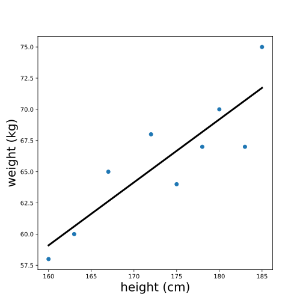

Note that the units of the intercept and slope of a regression line match the units of the original variables; 
the intercept of this line is measured in kg, and the slope is measured in kg/cm. 
To make sense of the intercept (which we calculated previously as -21.67 kg), let’s zoom out on this plot:

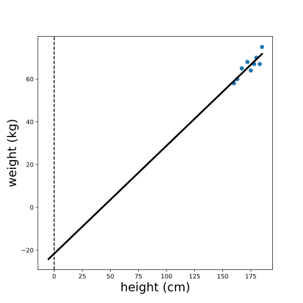

plot of height vs. weight with a regression line drawn through the points, zoomed out so that we can see where the line crosses the y-axis (a vertical line at x = 0)

We see that the intercept is the predicted value of the outcome variable (weight) when the predictor variable (height) is equal to zero. 
In this case, the interpretation of the intercept is that a person who is 0 cm tall is expected to weigh -21 kg. 
This is pretty non-sensical because it’s impossible for someone to be 0 cm tall!

However, in other cases, this value does make sense and is useful to interpret. 
For example, if we were predicting ice cream sales based on temperature, the intercept would be the expected sales when the temperature is 0 degrees.

To visualize the slope, let’s zoom in on our plot:

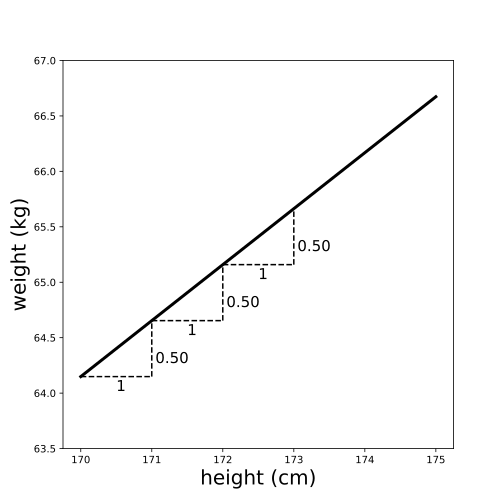

plot of height vs. weight with a regression line drawn through the points, 
zoomed in so that we can see that each horizontal increase of height by 1cm is associated with a 0.5 kg increase in height.

Remember that slope can be thought of as rise/run — the ratio between the vertical and horizontal distances between any two points on the line. 
Therefore, the slope (which we previously calculated to be `0.50` kg/cm) is the expected difference in the outcome variable (weight) for a one unit difference in the predictor variable (height). 
In other words, we expect that a one centimeter difference in height is associated with 0.5 additional kilograms of weight.

Note that the slope gives us two pieces of information: 
the magnitude AND the direction of the relationship between the `x` and `y` variables. 
For example, suppose we had instead fit a regression of weight with minutes of exercise per day as a predictor — and calculated a slope of `-0.1`. 
We would interpret this to mean that people who exercise for one additional minute per day are expected to weigh 0.1 kg LESS.

# [Assumptions of Linear Regression Part 1](https://www.codecademy.com/courses/linear-regression-mssp/lessons/introduction-to-linear-regression/exercises/assumptions-of-linear-regression-part-1)

There are a number of assumptions of simple linear regression, which are important to check if you are fitting a linear model. 
The first assumption is that the relationship between the outcome variable and predictor is linear (can be described by a line). 
We can check this before fitting the regression by simply looking at a plot of the two variables.

The next two assumptions (normality and heteroscedasticity) are easier to check after fitting the regression. 
We will learn more about these assumptions in the following exercises, but first, we need to calculate two things: 
***fitted values*** and ***residuals***.

Again consider our regression model to predict weight based on height (model formula `'weight ~ height'`). 
The fitted values are the predicted weights for each person in the dataset that was used to fit the model, 
while the residuals are the differences between the predicted weight and the true weight for each person. 
Visually:

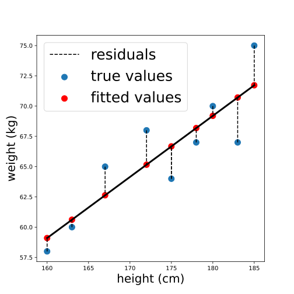

plot showing a line with points on either side. 
Dotted lines connect each point to the closest vertical location on the line, which is labeled as the fitted value for that point.

We can calculate the fitted values using `.predict()` by passing in the original data. 
The result is a pandas series containing predicted values for each person in the original dataset:
```py
fitted_values = results.predict(body_measurements)
print(fitted_values.head())
```
Output:
```
0    66.673077
1    59.100962
2    71.721154
3    70.711538
4    65.158654
dtype: float64
```

The residuals are the differences between each of these fitted values and the true values of the outcome variable. 
They can be calculated by subtracting the fitted values from the actual values. 
We can perform this element-wise subtraction in Python by simply subtracting one python series from the other, as shown below:
```py
residuals = body_measurements.weight - fitted_values
print(residuals.head())
```
Output:
```
0   -2.673077
1   -1.100962
2    3.278846
3   -3.711538
4    2.841346
dtype: float64
```

# [Assumptions of Linear Regression Part 2](https://www.codecademy.com/courses/linear-regression-mssp/lessons/introduction-to-linear-regression/exercises/assumptions-of-linear-regression-part-2)

Once we’ve calculated the fitted values and residuals for a model, we can check the normality and homoscedasticity assumptions of linear regression.

## Normality assumption

The normality assumption states that the residuals should be normally distributed. 
To check this assumption, we can inspect a histogram of the residuals and make sure that the distribution looks approximately normal (no skew or multiple “humps”):
```py
plt.hist(residuals)
plt.show()
```

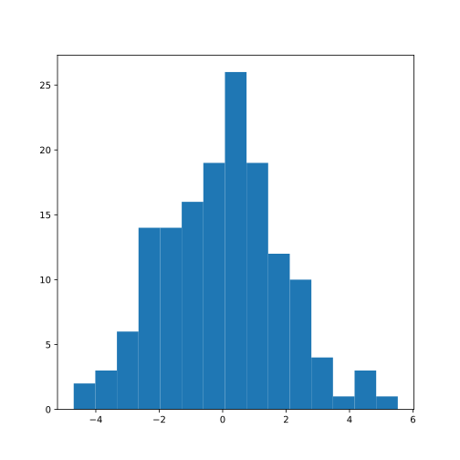

symmetric histogram with a single hump

These residuals appear normally distributed, leading us to conclude that the normality assumption is satisfied.

If the plot instead looked something like the distribution below (which is skewed right), we would be concerned that the normality assumption is not met:

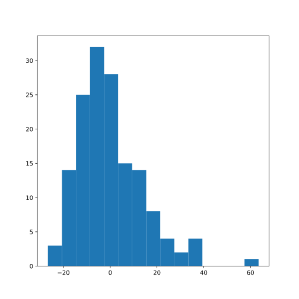

histogram which is right skewed: there is a longer tail on the right side than the left

## Homoscedasticity assumption

Homoscedasticity is a fancy way of saying that the residuals have equal variation across all values of the predictor variable. 
A common way to check this is by plotting the residuals against the fitted values.
```py
plt.scatter(fitted_values, residuals)
plt.show()
```

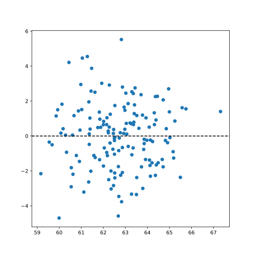

scatter plot with a splatter of randomly distributed points

If the homoscedasticity assumption is met, then this plot will look like a random splatter of points, centered around y = 0 (as in the example above).

If there are any patterns or asymmetry, that would indicate the assumption is NOT met and linear regression may not be appropriate. 
For example:

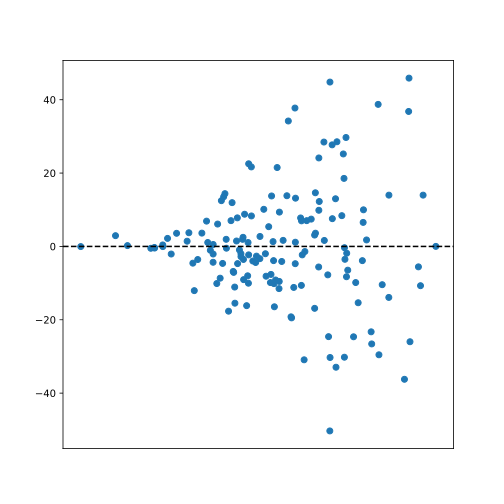

scatter plot with a funnel-shaped pattern of points

# [Categorical Predictors](https://www.codecademy.com/courses/linear-regression-mssp/lessons/introduction-to-linear-regression/exercises/categorical-predictors)

In the previous exercises, we used a quantitative predictor in our linear regression, but it’s important to note that we can also use categorical predictors. 
The simplest case of a categorical predictor is a binary variable (only two categories).

For example, suppose we surveyed 100 adults and asked them to report their height in cm and whether or not they play basketball. 
We’ve coded the variable `bball_player` so that it is equal to `1` if the person plays basketball and `0` if they do not. 
A plot of `height` vs. `bbball_player` is below:

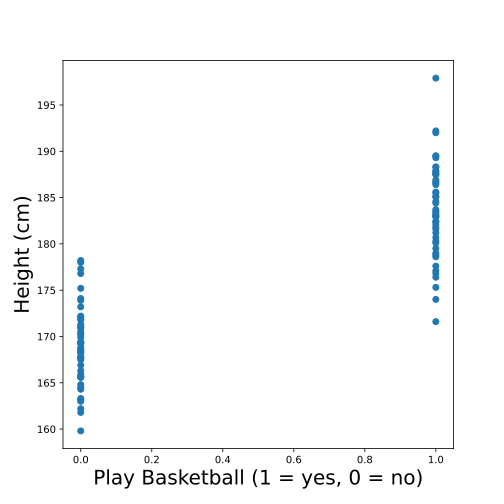

Scatter plot of height vs. whether or not someone plays basketball (0 means they don't, and 1 means they do); 
non-basketball players appear shorter on average than basketball players.

We see that people who play basketball tend to be taller than people who do not. 
Just like before, we can draw a line to fit these points. 
Take a moment to think about what that line might look like!

You might have guessed (correctly!) that the best fit line for this plot is the one that goes through the mean height for each group. 
To re-create the scatter plot with the best fit line, we could use the following code:

```py
# Calculate group means
print(data.groupby('play_bball').mean().height)
```
Output:
|  | play_bball |
| --- | --- |
| 0 |	169.016 |
| 1 |	183.644 |

```py
# Create scatter plot
plt.scatter(data.play_bball, data.height)
 
# Add the line using calculated group means
plt.plot([0,1], [169.016, 183.644])
 
# Show the plot
plt.show()
```
This will output the following plot (without the additional labels or colors):

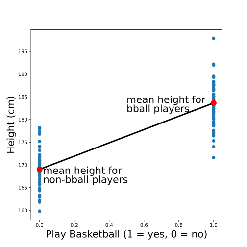

Same scatterplot as above, but with a line connecting the middle of the non-bball player heights to the middle of the bball player heights.

# [Categorical Predictors: Fit and Interpretation](https://www.codecademy.com/courses/linear-regression-mssp/lessons/introduction-to-linear-regression/exercises/categorical-predictors-fit-and-interpretation)

Now that we’ve seen what a regression model with a binary predictor looks like visually, we can actually fit the model using `statsmodels.api.OLS.from_formula()`, 
the same way we did for a quantitative predictor:

```py
model = sm.OLS.from_formula('height ~ play_bball', data)
results = model.fit()
print(results.params)
```
Output:
```
Intercept     169.016
play_bball     14.628
dtype: float64
```
Note that this will work if the `play_bball` variable is coded with `0`s and `1`s, but it will also work if it is coded with `True`s and `False`s, 
or even if it is coded with strings like `'yes'` and `'no'` 
(in this case, the coefficient label will look something like `play_bball[T.yes]` in the params output, indicating that `'yes'` corresponds to a `1`).

To interpret this output, we first need to remember that the intercept is the expected value of the outcome variable when the predictor is equal to zero. 
In this case, the intercept is therefore the mean height of non-basketball players.

The slope is the expected difference in the outcome variable for a one unit difference in the predictor variable. 
In this case, a one unit difference in `play_bball` is the difference between not being a basketball player and being a basketball player. 
Therefore, the slope is the difference in mean heights for basketball players and non-basketball players.

# [Review](https://www.codecademy.com/courses/linear-regression-mssp/lessons/introduction-to-linear-regression/exercises/review)

You’ve learned to:
* Fit a simple OLS linear regression model
* Use both **quantitative** and **binary categorical predictors**
* Interpret the **coefficients** of a regression model
* Check the **assumptions** of a regression model
