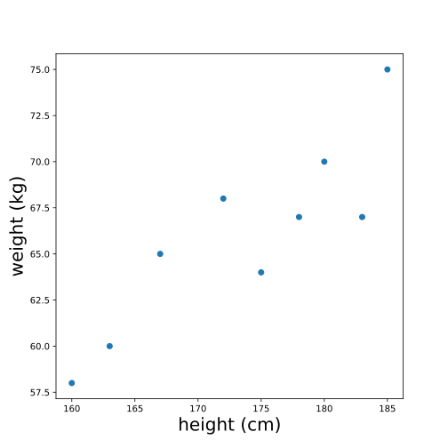

#### INTRODUCTION TO LINEAR REGRESSION

# [Introduction to Linear Regression](https://www.codecademy.com/courses/linear-regression-mssp/lessons/introduction-to-linear-regression/exercises/introduction-to-linear-regression)

Linear regression is a powerful modeling technique that can be used to understand the relationship between a quantitative variable and one or more other variables, 
sometimes with the goal of making predictions. 
For example, linear regression can help us answer questions like:
* What is the relationship between apartment size and rental price for NYC apartments?
* Is a mother’s height a good predictor of their child’s adult height?

The first step before fitting a linear regression model is exploratory data analysis and data visualization: is there a relationship that we can model? 
For example, suppose we collect heights (in cm) and weights (in kg) for 9 adults and inspect a plot of height vs. weight:
```py
plt.scatter(data.height, data.weight)
plt.xlabel('height (cm)')
plt.ylabel('weight (kg)')
plt.show()
```


scatter plot showing a positive linear relationship between height and weight (people who are taller tend to weigh more)

When we look at this plot, we see that there is some evidence of a relationship between height and weight: people who are taller tend to weigh more. 
In the following exercises, we’ll learn how to model this relationship with a line. 
If you were to draw a line through these points to describe the relationship between height and weight, what line would you draw?
