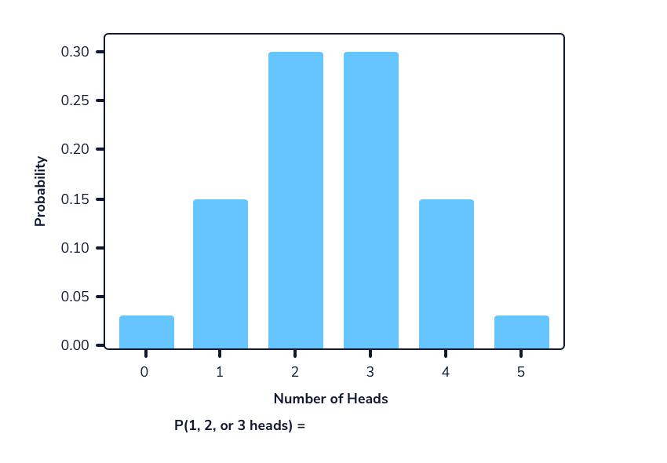

#### INTRODUCTION TO PROBABILITY DISTRIBUTIONS

# [Random Variables](https://www.codecademy.com/courses/probability-mssp/lessons/introduction-to-probability-distributions/exercises/random-variables)

A random variable is, in its simplest form, a function. 
It can equal any possible outcome from the sample space of an event.

Random variables must be numeric, meaning they always take on a number rather than a characteristic or quality. 
For example, when rolling a six-sided fair die, the random variable would be the number (between 1 and 6) from the resulting roll.

If the observed event does not have a numeric outcome, we can assign the random variable to equal 1 if there is a specific outcome and 0 otherwise. 
For example, when observing a fair coin flip, we can assign a “heads” to be the value 1 and a “tails” to be the value 0.

We will be using `random.choice(a, size = size, replace = True/False)` from the `numpy` library to simulate random variables in python. 
In this method:
* `a` is a list or other object that has values we are sampling from
* `size` is a number that represents how many values to  choose
* `replace` will equal either `True` or `False` to represent whether 
  * we will keep a value in a after drawing it (`replace = True`) 
  * or if we remove it from the pool (`replace = False`). 
If we were to roll a die multiple times, we would use `replace = True` because we don’t remove a value after observing it. 
But if we were to draw a card and leave it out of the deck before drawing again, we would do `replace = False`.

The following code simulates the outcome of rolling a fair die twice using `np.random.choice()`:
```py
import numpy as np
 
# 7 is not included in the range function
die_6 = range(1, 7)
 
rolls = np.random.choice(die_6, size = 2, replace = True)
 
print(rolls)
Output:

# [2, 5]
```

# [Discrete and Continuous Random Variables](https://www.codecademy.com/courses/probability-mssp/lessons/introduction-to-probability-distributions/exercises/discrete-and-continuous-random-variables)

## Discrete Random Variables

**When the possible values in a sample space are countable**, the random variable is called a discrete random variable. 
For example, rolling a regular 6-sided die would be considered a discrete random variable because the outcome options are limited to the numbers on the die.

Discrete random variables are also common when observing counting events, such as how many people entered a store on a randomly selected day. 
In this case, the values are countable in that they are limited to whole numbers (you can’t observe half of a person).

## Continuous Random Variables

**When the possible values in a sample space are uncountable**, the random variable is called a continuous random variable. 
These are generally measurement variables and are uncountable because measurements can always be more precise – meters, centimeters, millimeters, etc.

For example, the temperature in Los Angeles on a randomly chosen day is a continuous random variable. 
The temperature measurement can always extend to another decimal place (96 degrees, 96.44 degrees, 96.437 degrees, etc.).

# [Probability Mass Functions](https://www.codecademy.com/courses/probability-mssp/lessons/introduction-to-probability-distributions/exercises/probability-mass-functions)

The probability mass function (PMF) defines the specific probability distribution of the random variable. 
It is used to calculate the probability that a specific event from a discrete random variable occurs. 
For example, a PMF can be used to calculate the probability of rolling a three from a fair six-sided die.

Probability distributions explain the probabilities of observing the possible outcomes of an event. 
There are many different probability distributions. 
Each distribution has its own parameters that describe specific random events. 
You may be familiar with some of these parameters, like the mean and standard deviation, that define some of the most commonly used distributions in statistics.

For example, the distribution for flipping a fair coin ten times and counting the number of heads we observe is called a *binomial distribution*. 
The parameters for the binomial distribution are:
* `n` for the sample size (number of observations, in this case: ten coin flips)
* `p` for the probability of success (probability of seeing our determined outcome, in this case: the probability of seeing heads is 0.5)

This experiment would be classified as a `Binomial(n = 10, p = 0.5)` distribution. 
The graph below shows the probability mass function for this experiment. 
The heights of the bars represent the probability of observing each possible outcome as calculated by the PMF.


**The sum of the heights of all the bars will always equal 1.**

# [Calculating Probabilities using Python](https://www.codecademy.com/courses/probability-mssp/lessons/introduction-to-probability-distributions/exercises/calculating-probabilities-using-python)

The `binom.pmf()` method from the `scipy.stats` library can be used to calculate the probability of observing a specific value in an experiment. 
This method takes 3 values:
* `x`: the value of interest
* `n`: the sample size
* `p`: the probability of success

For example, in our experiment to flip a fair coin 10 times and count the number of heads, 
we can use the probability mass function to calculate the probability of observing a specific number, let’s say 6:
```py
# import necessary library
import scipy.stats as stats
 
# st.binom.pmf(x, n, p)
print(stats.binom.pmf(6, 10, 0.5))
Output:

# 0.205078
```
Notice that two of the three values that go into the `stats.binomial.pmf()` method are the parameters that define the binomial distribution: 
`n` represents the number of trials and `p` represents the probability of success.

# [Using the Probability Mass Function Over a Range](https://www.codecademy.com/courses/probability-mssp/lessons/introduction-to-probability-distributions/exercises/using-the-probability-mass-function-over-a-range)

We have seen that we can calculate the probability of observing a specific value using a probability mass function. 
What if we wanted to find the probability of observing a range of values for a discrete random variable? 
One way we could do this is by adding up the probabilities of each value.

Let’s say we were flipping a fair coin 5 times, and we wanted to know the probability of getting between 1 and 3 heads. 
We can visualize this scenario with the probability mass function:



We can calculate this using the following equation where P(x) is the probability of observing the number x successes:

<div align="center">
    <br />
    <br />
    <br />
    
</div>


