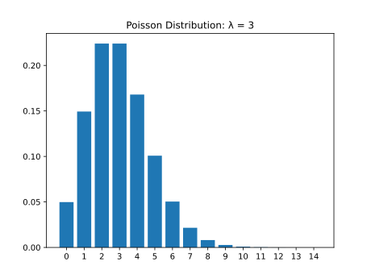
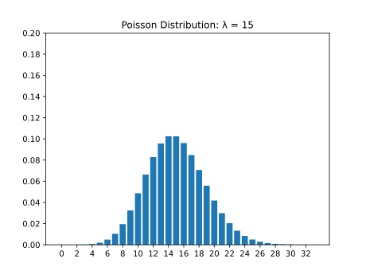

#### MORE ON PROBABILITY DISTRIBUTIONS

# [Introduction to the Poisson Distribution](https://www.codecademy.com/courses/probability-mssp/lessons/more-on-probability-distributions/exercises/introduction-to-the-poisson-distribution)

There are numerous probability distributions used to represent almost any random event. 
In the previous lesson, we learned about the 
**binomial distribution** to represent events like any number of *coin flips* as well as the 
**normal distribution** to represent events such as the *height of* a randomly selected *woman*.

The **Poisson distribution** is another common distribution, and it is used *to describe the number of times a certain event occurs* within a fixed time or space interval. 
For example, the Poisson distribution can be used to describe *the number of cars that pass through a specific intersection* between 4pm and 5pm on a given day. 
It can also be used to describe *the number of calls received in an office between 1pm to 3pm* on a certain day.

The Poisson distribution is defined by the **rate** parameter, symbolized by the Greek letter **lambda, λ**.

**Lambda** represents **the expected value — or the average value — of the distribution**. 
For example, if our expected number of customers between 1pm and 2pm is 7, then we would set the parameter for the Poisson distribution to be 7. 
The PMF for the Poisson(7) distribution is as follows:


# [Calculating Probabilities of Using the Probability Mass Function](https://www.codecademy.com/courses/probability-mssp/lessons/more-on-probability-distributions/exercises/calculating-probabilities-of-exact-values-using-the-poisson-distribution)

The Poisson distribution is a discrete probability distribution, so it can be described by a probability mass function and cumulative distribution function.

We can use the `poisson.pmf()` method in the `scipy.stats` library to evaluate the probability of observing a specific number given the parameter (expected value) of a distribution. 
For example, suppose that we expect it to rain 10 times in the next 30 days. 
The number of times it rains in the next 30 days is “Poisson distributed” with lambda = 10. 
We can calculate the probability of exactly 6 days of rain as follows:
```py
import scipy.stats as stats
# expected value = 10, probability of observing 6
stats.poisson.pmf(6, 10)
```
Output:
```py
0.06305545800345125
```
Like previous probability mass functions of discrete random variables, individual probabilities can be summed together to find the probability of observing a value in a range.

For example, if we expect it to rain 10 times in the next 30 days, the number of times it rains in the next 30 days is “Poisson distributed” with lambda = 10. 
We can calculate the probability of 12-14 days of rain as follows:
```py
import scipy.stats as stats
# expected value = 10, probability of observing 12-14
stats.poisson.pmf(12, 10) + stats.poisson.pmf(13, 10) + stats.poisson.pmf(14, 10)
```
Output:
```py
0.21976538076223123
```

# [Calculating Probabilities of a Range using the Cumulative Density Function](https://www.codecademy.com/courses/probability-mssp/lessons/more-on-probability-distributions/exercises/calculating-probabilities-of-a-range-using-the-poisson-distribution)

We can use the `poisson.cdf()` method in the `scipy.stats` library to evaluate the probability of observing a specific number or less given the expected value of a distribution. 
For example, if we wanted to calculate the probability of observing 6 or fewer days of rain in the next 30 days when we expected 10, we could do the following:
```py
import scipy.stats as stats
# expected value = 10, probability of observing 6 or less
stats.poisson.cdf(6, 10)
```
Output:
```py
0.130141420882483
```
This means that there is roughly a 13% chance that there will be 6 or fewer days of rain in the month in question.

We can also use this method to evaluate the probability of observing a specific number or more given the expected value of the distribution. 
For example, if we wanted to calculate the probability of observing 12 or more days of rain in the next 30 days when we expected 10, we could do the following:
```py
import scipy.stats as stats
# expected value = 10, probability of observing 12 or more
1 - stats.poisson.cdf(11, 10)
```
Output:
```py
0.30322385369689386
```
This means that there is roughly a 30% chance that there will be 12 or more days of rain in the month in question.

Note that we used 11 in the statement above even though 12 was the value given in the prompt. 
We wanted to calculate the probability of observing 12 or more days, which includes 12. 
`stats.poisson.cdf(11, 10)` evaluates the probability of observing 11 or fewer days, 
so `1 - stats.poisson.cdf(11, 10)` would equal the probability of observing 12 or more days.

Summing individual probabilities over a wide range can be cumbersome. 
It is often easier to calculate the probability of a range using the cumulative density function instead of the probability mass function. 
We can do this by taking the difference between the CDF of the larger endpoint and the CDF of one less than the smaller endpoint of the range.

For example, while still expecting 10 days of rain in the next 30 days, we could use the following code to calculate the probability of observing between 12 and 18 days of rain:
```py
import scipy.stats as stats
# expected value = 10, probability of observing between 12 and 18
stats.poisson.cdf(18, 10) - stats.poisson.cdf(11, 10)
```
Output:
```py
0.29603734909303947
```

# [Expectation of the Poisson Distribution](https://www.codecademy.com/courses/probability-mssp/lessons/more-on-probability-distributions/exercises/expectation-of-the-poisson-distribution)

Earlier, we mentioned that the parameter lambda (λ) is the expected value (or average value) of the Poisson distribution. 
But what does this mean?

Let’s put this into context: let’s say we are salespeople, and after many weeks of work, we calculate our average to be 10 sales per week. 
If we take this value to be our expected value of a Poisson Distribution, the probability mass function will look as follows:


The tallest bar represents the value with the highest probability of occurring. 
In this case, the tallest bar is at 10. 
This does not, however, mean that we will make 10 sales. 
It means that on average, across all weeks, we expect our average to equal about 10 sales per week.

Let’s look at this another way. 
Let’s take a sample of 1000 random values from the Poisson distribution with the expected value of 10. 
We can use the `poisson.rv()` method in the `scipy.stats` library to generate random values:
```py
import scipy.stats as stats
 
# generate random variable
# stats.poisson.rvs(lambda, size = num_values)
rvs = stats.poisson.rvs(10, size = 1000)
```
The histogram of this sampling looks like the following:


We can see observations of as low as 2 but as high as 20. 
The tallest bars are at 9 and 10. 
If we took the average of the 1000 random samples, we would get:
```py
print(rvs.mean())
```
Output:
```py
10.009
```
This value is very close to 10, confirming that over the 1000 observations, the expected value (or average) is 10.

When we talk about the expected value, we mean the average over many observations. 
This relates to the Law of Large Numbers: 
the more samples we have, the more likely samples will resemble the true population, and the mean of the samples will approach the expected value. 
So even though the salesperson may make 3 sales one week, they may make 16 the next, and 11 the week after. 
In the long run, after many weeks, the expected value (or average) would still be 10.

# [Spread of the Poisson Distribution](https://www.codecademy.com/courses/probability-mssp/lessons/more-on-probability-distributions/exercises/variance-of-the-poisson-distribution)

Probability distributions also have calculable variances. 
**Variances** are a way of measuring *the spread or dispersion of values and probabilities in the distribution*. 
For the **Poisson distribution**, the **variance** is simply *the value of lambda (λ)*, meaning that the expected value and variance are equivalent in Poisson distributions.

We know that the Poisson distribution has a discrete random variable and must be greater than 0 (think, a salesperson cannot have less than 0 sales, a shop cannot have fewer than 0 customers), so as the expected value increases, the number of possible values the distribution can take on would also increase.

The first plot below shows a Poisson distribution with lambda equal to three, and the second plot shows a Poisson distribution with lambda equal to fifteen. 
Notice that in the second plot, the spread of the distribution increases. 
Also, take note that the height of the bars in the second bar decrease since there are more possible values in the distribution.

<div>
    
    
</div>


