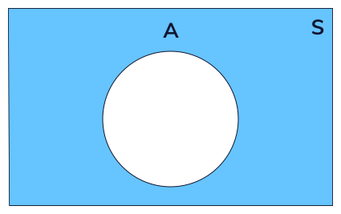

#### RULES OF PROBABILITY

# [Introduction](https://www.codecademy.com/courses/probability-mssp/lessons/rules-of-probability/exercises/introduction)

Probability is a way to quantify uncertainty. 
When we flip a fair coin, we say that there is a 50 percent chance (probability = 0.5) of it coming up tails. 
This means that if we flip INFINITELY many fair coins, half of them will come up tails. 
Similarly, when we roll a six-sided die, we say there is a 1 in 6 chance of rolling a five.

What if we flip a coin in one hand and roll a die in the other at the same time. 
What is the probability that the coin comes up tails AND the die comes up as a five? 
Is there a way to quantify the probability that these two different events BOTH occur? 
In this lesson, we will walk through different rules of probability that help us quantify the probability of multiple random events.

# [Union, Intersection, and Complement](https://www.codecademy.com/courses/probability-mssp/lessons/rules-of-probability/exercises/union-intersection-and-complement)

Let’s dive into some key concepts we will use throughout this lesson: union, intersection, and complement.

## Union

The union of two sets encompasses **any element** that **exists** in either one or both of them. 
We can represent this visually as a *Venn diagram*.

For example, let’s say we have two sets, `A` and `B`. 
* `A` represents rolling an odd number with a six-sided die (the set {1, 3, 5}). 
* `B` represents rolling a number greater than two (the set {3, 4, 5, 6}). 

The union of these two sets would be everything in either set `A`, set `B`, or both: {1, 3, 4, 5, 6}. 
We can write the union of two events mathematically as **(A or B)**.

## Intersection

The intersection of two sets encompasses **any element** that **exists in both** of the sets. 
Visually:

The intersection of the above sets (`A` represents rolling an odd number on a six-sided die and `B` represents rolling a number greater than two) 
includes any value that appears in both sets: {3, 5}. 
We can write the union of two events mathematically as **(A and B)**.

## Complement

Lastly, the complement of a set consists of **all** possible outcomes outside of the set**. 
Visually:

