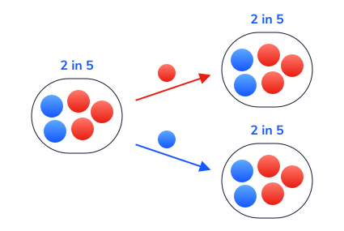
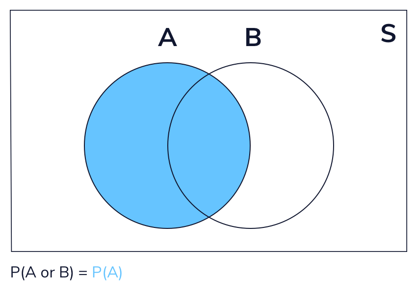

#### RULES OF PROBABILITY

# [Introduction](https://www.codecademy.com/courses/probability-mssp/lessons/rules-of-probability/exercises/introduction)

Probability is a way to quantify uncertainty. 
When we flip a fair coin, we say that there is a 50 percent chance (probability = 0.5) of it coming up tails. 
This means that if we flip INFINITELY many fair coins, half of them will come up tails. 
Similarly, when we roll a six-sided die, we say there is a 1 in 6 chance of rolling a five.

What if we flip a coin in one hand and roll a die in the other at the same time. 
What is the probability that the coin comes up tails AND the die comes up as a five? 
Is there a way to quantify the probability that these two different events BOTH occur? 
In this lesson, we will walk through different rules of probability that help us quantify the probability of multiple random events.

# [Union, Intersection, and Complement](https://www.codecademy.com/courses/probability-mssp/lessons/rules-of-probability/exercises/union-intersection-and-complement)

Let’s dive into some key concepts we will use throughout this lesson: union, intersection, and complement.

## Union

The union of two sets encompasses **any element** that **exists** in either one or both of them. 
We can represent this visually as a *Venn diagram*.

For example, let’s say we have two sets, `A` and `B`. 
* `A` represents rolling an odd number with a six-sided die (the set {1, 3, 5}). 
* `B` represents rolling a number greater than two (the set {3, 4, 5, 6}). 

The union of these two sets would be everything in either set `A`, set `B`, or both: {1, 3, 4, 5, 6}. 
We can write the union of two events mathematically as **(A or B)**.

## Intersection

The intersection of two sets encompasses **any element** that **exists in both** of the sets. 
Visually:

The intersection of the above sets (`A` represents rolling an odd number on a six-sided die and `B` represents rolling a number greater than two) 
includes any value that appears in both sets: {3, 5}. 
We can write the union of two events mathematically as **(A and B)**.

## Complement

Lastly, the complement of a set consists of **all possible outcomes outside of the set**. 
Visually:

Consider set `A` from the above example (rolling an odd number on a 6-sided die). 
The complement of this set would be rolling an even number: {2, 4, 6}. 
We can write the complement of set `A` as `A``C`. 
One key feature of complements is that **a set and its complement cover the entire sample space**. 
In this die roll example, **the set of even numbers and odd numbers** would **cover all possible rolls**: {1, 2, 3, 4, 5, 6}.

# [Independence and Dependence](https://www.codecademy.com/courses/probability-mssp/lessons/rules-of-probability/exercises/independence-and-dependence)

Imagine that we flip a fair coin 5 times and get 5 heads in a row. 
Does this affect the probability of getting heads on the next flip? 
Even though we may feel like it’s time to see “tails”, it is impossible for a past coin flip to impact a future one. 
The fact that **previous** coin flips **do not affect future ones** is called **independence**. 

### Two events are independent if the occurrence of one event does not affect the probability of the other.

Are there cases where previous events do affect the outcome of the next event? 
Suppose we have a bag of five marbles: two marbles are blue and three marbles are red. 
If we take one marble out of the bag, what is the probability that the second marble we take out is blue?

This describes two events that are **dependent**. 
The probability of grabbing a blue marble in the second event depends on whether we take out a red or a blue marble in the first event.

What if we had put back the first marble? 
Is the probability that we pick a blue marble second independent or dependent on what we pick out first? 
In this case, the events would be **independent**.

Why do we care if events are independent or dependent? 
Knowing this helps us quantify the probability of events that depend on preexisting knowledge. 
This helps researchers understand and predict complex processes such as:
* Effectiveness of vaccines
* The weather on a particular day
* Betting odds for professional sports games

We will explore applications of this further in the lesson!

We pick out two cards from a standard deck of 52 cards without replacement. 
* **Event A** is that we pick an Ace on the first draw. 
* **Event B** is that we pick an Ace on the second draw.

  
Are events A and B independent?

  Not, they are dependent.

Suppose we roll a six-sided die two times. 
* **Event A** is that we roll a 3 on the first roll. 
* **Event B** is that we roll a 3 on the second roll. Are events A and B independent?

  
Are events A and B independent?

  Yes, they are independent.

Suppose we flip a coin ten times. 
* **Event A** is that we flip all heads on the first five flips. 
* **Event B** is that we flip all heads on the second five flips. 

  
Are events A and B independent?

  Yes, they are independent.

# [Mutually Exclusive Events](https://www.codecademy.com/courses/probability-mssp/lessons/rules-of-probability/exercises/mutually-exclusive-events)

### Two events are considered mutually exclusive if they cannot occur at the same time. 

For example, consider a single coin flip: the events “tails” and “heads” are mutually exclusive because we cannot get both tails and heads on a single flip.

We can visualize two mutually exclusive events as a pair of non-overlapping circles. 
They do not overlap because there is no outcome for one event that is also in the sample space for the other:

What about events that are **not mutually exclusive**? 
If event `A` is rolling an odd number and event `B` is rolling a number greater than two, these events are not mutually exclusive. 
**They have** an **intersection** of {3, 5}. 

### Any events that have a non-empty intersection are not mutually exclusive.

We have a bag of five marbles: three are green and two are blue. 
Suppose that we pick one marble from the bag. 
* **Event A** is that the marble is green. 
* **Event B** is that the marble is blue.

  
Are these events mutually exclusive?

  Yes, they are mutually exclusive.

We roll a die once. 
* **Event A** is rolling an odd number. 
* **Event B** is rolling a number greater than four.

  
Are these events mutually exclusive?

  Not, they are not mutually exclusive.

We roll a die once. 
* **Event A** is rolling an even number. 
* **Event B** is rolling a number less than two. 

  
Are these events mutually exclusive?

  Yes, they are mutually exclusive.

# [Addition Rule](https://www.codecademy.com/courses/probability-mssp/lessons/rules-of-probability/exercises/addition-rule)

Now, it’s time to apply these concepts to calculate probabilities.

Let’s go back to one of our first examples: 
* **event A** is rolling an odd number on a six-sided die and 
* **event B** is rolling a number greater than two. 

What if we want to find the probability of one or both events occurring? 
This is the **probability of the union of A and B**:

<h4 align="center">
  P(A or B)
</h4>

We can visualize this calculation as follows:

